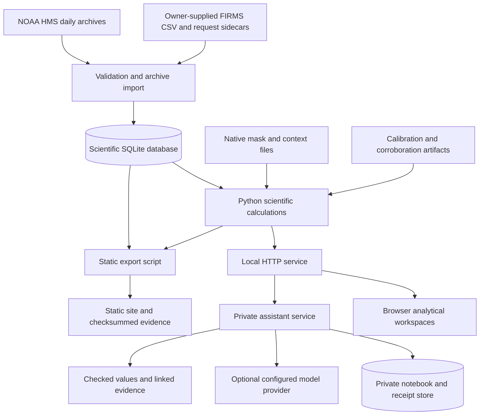

# Ignis-Atlassia — Comprehensive Project Documentation

**Documentation date:** 5 October 2026, Asia/Dhaka
**Project name in the current README:** Ignis-Atlassia  
**Python package and internal project name:** FireAtlas / `fireatlas`  
**Package version:** `0.1.0`  
**Challenge named by the repository:** NASA Space Apps 2026 — Harmonization of MODIS and VIIRS Hot Spots  
**Repository URL recorded in the project:** https://github.com/AhnafZ778/NASA-Spaceapps  
**Default local website:** http://127.0.0.1:8000/

This document describes the working files in this checkout, including uncommitted implementation changes, rather than only the last Git commit. Its primary evidence is the source code, checked-in scientific artifacts, the static release manifest, and a read-only inspection of the existing scientific database. It is intended for project contributors, reviewers, presenters, and anyone trying to understand or reproduce the application.

**Reading guide:** Sections 1–6 explain the product; sections 7–17 explain its data and scientific methods; sections 18–24 explain the assistant, architecture, interfaces, and operation; sections 25–30 cover reproducibility, validation, limitations, future work, and terminology.

Some earlier planning files describe an intended PostGIS/FastAPI/React architecture, a fully light website shell, missing MCD64A1 inputs, or older data totals. The present application uses SQLite, a Python HTTP server, browser JavaScript, a dark globe shell with light analytical workspaces, and selected existing MCD64A1 artifacts. Where these descriptions differ, this document identifies the current implementation and the relevant scope. No live provider availability, public deployment, competition eligibility, or independent scientific endorsement was verified while writing this document.

## Contents

1. [Project overview](#1-project-overview)
2. [Problem and motivation](#2-problem-and-motivation)
3. [Objectives and intended users](#3-objectives-and-intended-users)
4. [Core scientific concepts](#4-core-scientific-concepts)
5. [Feature inventory](#5-feature-inventory)
6. [Website and user workflows](#6-website-and-user-workflows)
7. [Data sources and current inventory](#7-data-sources-and-current-inventory)
8. [Archive provenance and completeness](#8-archive-provenance-and-completeness)
9. [Database and observation contract](#9-database-and-observation-contract)
10. [Common-grid counting and sensor bridge](#10-common-grid-counting-and-sensor-bridge)
11. [Harmonized calendar and processing gaps](#11-harmonized-calendar-and-processing-gaps)
12. [Calibration and held-out evaluation](#12-calibration-and-held-out-evaluation)
13. [Seasonal comparisons and descriptive timing](#13-seasonal-comparisons-and-descriptive-timing)
14. [Native fire masks and independent review](#14-native-fire-masks-and-independent-review)
15. [MCD64A1 and environmental context](#15-mcd64a1-and-environmental-context)
16. [Historical fire replay](#16-historical-fire-replay)
17. [Research lab methods](#17-research-lab-methods)
18. [Scientific assistant](#18-scientific-assistant)
19. [System architecture and technology stack](#19-system-architecture-and-technology-stack)
20. [Repository map](#20-repository-map)
21. [HTTP and command-line interfaces](#21-http-and-command-line-interfaces)
22. [Installation and local operation](#22-installation-and-local-operation)
23. [Static release and hosting](#23-static-release-and-hosting)
24. [Reproducible exports and evidence bundles](#24-reproducible-exports-and-evidence-bundles)
25. [Tests and verification](#25-tests-and-verification)
26. [Security, privacy, and responsible interpretation](#26-security-privacy-and-responsible-interpretation)
27. [Current maturity and remaining work](#27-current-maturity-and-remaining-work)
28. [Suggested demonstration](#28-suggested-demonstration)
29. [Glossary](#29-glossary)
30. [Source documents and maintenance](#30-source-documents-and-maintenance)

## 1. Project overview

Ignis-Atlassia is a research prototype that turns imported satellite thermal detections into an inspectable fire-activity calendar and a set of scientific workspaces. Its central question is: **how can MODIS and VIIRS observations be compared without mistaking different sensor resolutions, incomplete exports, or processing gaps for changes in fire activity?**

The application stores original NASA FIRMS records, maps eligible detection centroids onto a shared 1 km equal-area grid, groups activity by UTC date, and exposes the records and assumptions behind each result. The newer regional calendar uses VIIRS-equivalent active-fire cell-days as its display metric and labels MODIS-based estimates separately from observed VIIRS values. The older generic calendar reports the union of distinct detected grid cells per day. These are related, explicitly different outputs.

The project includes a three-dimensional globe, regional Atlas, historical fire replay, research tools, data provenance pages, calibration and validity evidence, a native-mask review form, downloadable evidence bundles, and an optional scientific assistant. The assistant helps navigate and discuss stored evidence; numerical results come from calculation tools over imported data.

Two contrasting regional study boxes provide the main historical comparison: Northern California and Punjab–Haryana. Park, Camp, and Grove are named historical replay studies. Their selected points are observations inside an area and time window, not a validated assignment of every point to an official incident.

The project has two delivery modes:

- **Local service:** the Python server reads the existing scientific database, supports scientific calculations and local imports, and can host private assistant workspaces.
- **Static evidence release:** exported HTML, scripts, compressed observations, calendars, replay studies, and validity artifacts can be served without a Python API. This is a dated snapshot with a smaller set of available actions.

The scientific boundary stated in the repository remains central: **FireAtlas is a research and learning tool. It is not an operational fire-management, evacuation, or flight-planning tool.**

## 2. Problem and motivation

Satellite fire products have different native resolutions, source platforms, processing histories, confidence formats, and observation opportunities. Counting their rows together can create a misleading apparent trend. Several VIIRS observations can occupy the same coarse area as one MODIS observation, and several satellites can observe the same location on one date.

The project addresses five practical problems:

1. **Cross-sensor comparability:** retain native source records while offering a common spatial counting unit.
2. **Incomplete history:** distinguish verified complete exports from partial positive evidence and missing dates.
3. **Traceability:** connect chart values to product versions, acquisition times, original rows, file hashes, and import metadata.
4. **Interpretation:** explain why a thermal detection, occupied cell-day, candidate group, and burned-area product measure different things.
5. **Reproducibility:** let a reviewer download frozen inputs and independently recount the displayed results.

A blank hotspot map is especially easy to misread. It can reflect an incomplete export, cloud, no pass, an unavailable product, or an actual absence of detections in a complete collected record. FIRMS points alone cannot resolve those alternatives. The interface therefore treats unknown observation opportunity as a substantive result.

## 3. Objectives and intended users

The implemented product aims to make sensor differences visible, preserve scientific provenance, and support transparent exploratory comparisons. It favors interpretable arithmetic, evidence drawers, downloadable inputs, and explicit state labels over unexplained combined scores.

| Intended user | Main activity | Useful output |
| --- | --- | --- |
| Student or Space Apps reviewer | Explore a region and understand the sensor distinction | Calendar, Sensor Bridge, definitions, selected source records |
| Researcher or analyst | Examine paired activity, source versions, gaps, and candidate groups | JSON/CSV results, calibration artifacts, research report |
| Independent reviewer | Check native masks and reproduce recorded values | Evidence ZIP, review queue, checksum manifest, recount |
| Presenter | Explain the project with a traceable historical example | Globe, replay, method page, share card, evidence links |
| Contributor | Reproduce the environment and extend the implementation | Python modules, CLI commands, tests, static export workflow |

The tool supports regional monitoring research and learning about seasonal patterns. It does not establish the cause of a detection, determine that an area is safe, prescribe operational decisions, or produce a validated spread forecast.

## 4. Core scientific concepts

| Concept | Meaning in this project | Interpretation limit |
| --- | --- | --- |
| Hotspot / detection | A dated satellite thermal observation in an imported source row | Not an incident count, ignition point, perimeter, or burned area |
| Native resolution | MODIS approximately 1 km; the selected VIIRS active-fire product 375 m | The common analysis grid does not make sensor sensitivity identical |
| Common grid cell | Integer cell coordinates obtained from a centroid projected to EPSG:6933 | Does not reproduce the full scan/track footprint |
| Cell-day | One occupied common cell on one UTC date | The same cell on another date adds another cell-day |
| Joint cell-days | Daily union of eligible MODIS and VIIRS occupied cells, summed over dates | Does not deduplicate physical fires |
| VIIRS-equivalent activity | Observed VIIRS cell-days or an explicitly labeled scaled MODIS estimate | An estimate is not a missing VIIRS measurement |
| Complete export | A collected request window covers the full source/month and area | Does not establish cloud-free coverage or every satellite pass |
| Partial evidence | Positive rows exist without a verified complete source window | Empty dates remain unknown |
| Confidence | Original MODIS numeric or VIIRS categorical source confidence | The scales are retained separately |
| FRP | Source-reported Fire Radiative Power, expressed in MW | Not added to cell-day activity or calibrated across sensors |
| Candidate group | Detections connected by chosen distance and date-gap rules | Not a validated wildfire event |
| Native fire mask | Satellite product pixels carrying class/quality evidence | Current sampled evidence does not supply a complete AOI exposure denominator |
| Lagged corroboration | Retrospective MCD64A1 Burn Date/QA context | Not real-time ground truth or a predicted perimeter |

All scientific acquisition dates are UTC. The local timezone on this document is for its preparation date; it does not change satellite calendar binning.

## 5. Feature inventory

| Feature | Current implementation | Main dependency or boundary |
| --- | --- | --- |
| Three-dimensional Earth overview | Existing terrain globe, satellite controls, geographic focus, imported observation overlays | WebGL and external terrain/basemap services |
| Regional calendar | Northern California and Punjab–Haryana, 2006–2026 display range | Earlier row-only history is partial |
| Sensor Bridge | MODIS, VIIRS, shared and source-only cells, raw rows, excluded types | Common-centroid grid; no event or footprint equivalence |
| Source inspection | Original fields, UTC timestamp, native confidence, source FRP, version, hashes | Compact on-screen lists are bounded |
| Historical replay | Park, Camp, Grove; daily/cumulative views, playback, source comparison | Detections inside a frozen study window |
| Replay environmental layers | Existing local case rasters and online context where configured | Availability differs by case |
| Research Lab | Paired daily overlap, exploratory ratios, candidate grouping, optional supplied coverage masks | Local service for new calculations |
| Calibration | Region-specific stored fits and nested held-out results | Short version-matched sample; intervals withheld |
| Native-mask validity | Processed Park/Grove evidence, reconciliation, deterministic review queues | Independent human review remains pending |
| Data Sources | Regional ledger, import status, source downloads and method limitations | Import/sync actions are local-service functions |
| Evidence exports | CSV/JSON, study ZIP, validity ZIP, checksums, native-review template | Different bundles freeze different scopes |
| Shareable study selection | Validated URL state restoration and copying | Shared URLs use the recipient's current data |
| Scientific assistant | Stored-data investigation tools, map/notebook/chart workspace, optional inference | Conversational models and speech require configured services |
| Static hosting | Exported evidence and named studies without an API | Custom research and private assistant actions need a backend |
| Research Studio | Private revisioned evidence board, deterministic investigation template, editable six-chapter story, portable reader export, typed workflow templates and optional local documentary renderer | Values remain bound to frozen scientific receipts; hosted collaboration, narration and Remotion remain capability-gated |

Earlier fictional crew-response exercises, the synthetic website selector, and PWA/offline-shell instructions belong to historical work. They are not current public features. Synthetic generators remain in the repository for automated fixtures, and the scientific server rejects a database containing generated demonstration batches.

## 6. Website and user workflows

### 6.1 Main workspaces

| Destination | Canonical route | Purpose |
| --- | --- | --- |
| Earth overview | `/` or `/index.html` | Existing dark globe, controls and frozen snapshot; logo destination |
| Explore | `/atlas.html` | Default regional harmonized calendar, Sensor Bridge, separate combined-detection view and matching exports |
| Investigate | `/investigate.html` | One study controller, synchronized 2D sensor panes, UTC timeline, rows, contextual JARVIS/private notebook and optional 3D |
| Research Lab | `/research.html?tab=…` | Comparison, Candidate Groups, Sensitivity and Exposure |
| Evidence | `/evidence.html?tab=…` | Sources, Method, Calibration, Validity and Reproduce/Review |
| Research Studio | `/studio.html` | Private evidence board, Story Director, workflow checks, rooms and static-reader export |

Real static compatibility pages forward `/replay.html` and `/assistant.html` to Investigate; candidate/exposure pages to the corresponding Research tab; data/method/review pages to the corresponding Evidence tab; and research-validation to Evidence Method. Explicit tabs take precedence over inferred tabs. Queries, meaningful fragments and project-subpath hosting are preserved. The home header forwards recognized legacy calendar fragments; ordinary visits retain the existing landing behavior.

The landing protection boundary permits only its header/navigation block to change. The floating-header class, glass wrapper and mobile controls retain their original structure. Both source/generated HTML outside that header and 75 protected asset hashes are checked by `scripts/check_landing_preservation.py`. Analytical pages use their own context module and scoped styles; the landing retains its original shared scripts.

The home page currently embeds `terrain-earth.html?embed=landing`. Legacy `earth.html` and `Globe.html` assets are still present; their existence does not establish which renderer the current home page uses.

Its two evidence toggles have separate meanings. **Satellite signals** display imported recent thermal observations grouped into 1° geographic bins, which are different from the regional 1 km analysis cells. **Wildfires** display a curated historical casebook from `documented-fires.json`, with fifteen records in the current checked-in artifact, approximate affected-area markers, dated summaries and source links. The casebook is not exhaustive, does not describe current conditions, and is not a NASA-derived incident classification or perimeter layer.

### 6.2 Regional calendar workflow

Start with one of the two study regions, select a year and month, then choose a UTC day. The monthly verdict explains what comparison is supported. The Sensor Bridge exposes source-specific readings, native detail, shared-cell behavior, and any transformation used. The evidence drawer lets the user inspect original source rows, and exports provide a path to recounting.

The calendar display range includes years with partial or unknown input. Selecting an unsupported month should preserve that selection and show its evidence state; silently replacing it with a different available month would change the question being asked.

### 6.3 Visual language and accessibility

The latest overview shell uses a dark space-themed presentation. Analytical workspaces use light surfaces with dark text and cobalt actions. Sensor identity is represented by both color and shape: MODIS amber circles, VIIRS cyan diamonds, and shared cells green squares.

Data state is a separate visual dimension. Observed, estimated, documented-gap, and unknown states have explicit labels and differentiated solid/hatch treatments. A source color alone is not an uncertainty indicator. Accessible tables, text readouts, keyboard-reachable evidence controls, and responsive layouts help users inspect values without relying only on a map or chart.

### 6.4 Saved state and map performance

Analytical pages share an applied `FireAtlasContext` superset carrying exact AOI/dates, region/case, selected day, metric/cohort, geometry, display state and provenance. Draft edits do not apply a result. Committed selections/tabs use browser history; frame scrubbing and display changes replace it. Back/Forward restores through the same context path. Camera focus does not alter the scientific selection, and cross-month studies keep their interval. Research explicitly selects a supported month intersection. Public URLs omit private notebook content, ownership tokens and evidence identifiers. The current Atlas supports copying a study URL and downloading a study bundle. Named saved-view controls described in older requirements are absent from the current frontend. Browser persistence instead includes hash-bound native-review drafts and the assistant archive chooser's open/closed preference. Private assistant notebooks use separate server-side storage; URL restoration is not a frozen evidence bundle.

At low zoom, the generic map endpoint groups records into geographic bins. At detailed zoom, it displays a bounded sample of approximately 1,000 records rather than drawing every source row. Calendar calculations use the scientific input scope rather than this display sample. A daily source-row list can be limited to 200 entries with an explicit truncation flag. Full exports and calculation evidence must be used when exhaustive review is required.

## 7. Data sources and current inventory

### 7.1 Main sources

| Source | Role | Separation rule |
| --- | --- | --- |
| NASA FIRMS MODIS standard processing | Historical MODIS Terra/Aqua observations | Product versions remain visible; NRT is a different cohort |
| NASA FIRMS VIIRS S-NPP standard processing | Historical Suomi NPP 375 m observations | Main paired VIIRS source |
| NASA FIRMS recent NRT files | Imported globe snapshot and recent source evidence | Not stitched into the standard historical baseline |
| NOAA HMS VIIRS | Independent historical North American source cohort | Not merged into the NASA MODIS/S-NPP pair |
| Native MODIS/VIIRS mask and geolocation products | Park/Grove validity evidence | Sampled native evidence, not universal coverage |
| MCD64A1 Collection 6.1 | Dated retrospective Burn Date/QA corroboration | Separate from active-fire activity counts |
| MOD13Q1, MCD12Q1, NASADEM and GIBS context | Selected vegetation, land-cover and terrain layers | Context availability and resolution are stated by layer/case |
| Official incident records | Names, locations, dated references for named studies | Do not turn nearby detections into validated incident membership |

### 7.2 Current scientific database

The following values were obtained by read-only queries of `data/fireatlas.sqlite3` for this document. They count stored source records, not physical fires, and supersede older summary totals for this working database.

| Source ID | Stored rows | Earliest acquisition UTC | Latest acquisition UTC |
| --- | ---: | --- | --- |
| `MODIS_SP` | 456,202 | 2006-07-01 05:30 | 2026-06-30 17:29 |
| `VIIRS_SNPP_SP` | 1,539,557 | 2012-07-01 08:12 | 2026-06-30 09:16 |
| `NOAA_HMS_VIIRS` | 49,420 | 2021-07-01 09:03 | 2024-07-31 21:27 |
| `MODIS_NRT` | 83,076 | 2026-07-01 00:05 | 2026-09-27 09:09 |
| `VIIRS_SNPP_NRT` | 58,564 | 2026-07-01 00:26 | 2026-07-01 23:20 |
| `VIIRS_NOAA20_NRT` | 394,527 | 2026-09-20 00:39 | 2026-09-27 07:29 |
| `VIIRS_NOAA21_NRT` | 399,653 | 2026-09-20 00:01 | 2026-09-27 07:35 |
| **All stored sources** | **2,980,999** | — | — |

The two standard historical sources contain **1,995,759 records** in total. The scientific database currently contains no batches flagged as generated demonstration data. Neither fact establishes independent authentication of the supplied source files.

Earlier README/data-ledger snapshots report 1,994,162 standard records and 1,537,960 S-NPP rows. The present database contains 1,597 additional S-NPP source records in the Northern California scope. Archive provenance, source identifiers, and replay alias handling matter when comparing figures from different snapshots.

### 7.3 Regional study boxes

Bounding boxes are always in west, south, east, north order.

| Region | Identifier | Bounds | MODIS SP rows | S-NPP SP rows |
| --- | --- | --- | ---: | ---: |
| Northern California | `norcal` | `[-122.2, 38.8, -120.0, 41.0]` | 54,659 | 174,842 |
| Punjab–Haryana | `punjab-haryana` | `[73.8, 29.5, 77.6, 32.6]` | 401,543 | 1,364,715 |

The chosen boxes contrast a Californian forest/shrubland landscape with an agricultural landscape. Hotspot points do not independently classify forest fire, crop-residue burning, or another heat source. A dated context narrative is not a land-cover or cause classifier.

### 7.4 Clean checkout versus owner workspace

The owner-supplied original archives under `NASA_data/`, the main SQLite database, credentials, and private assistant state are local assets. A clean checkout does not recreate the owner's full imported database merely by installing the package.

The compact authentic Northern California NASA bundle contains 30,823 source rows for July 2022–June 2026. A separate NOAA HMS bundle supports the historical pilot. The server's ordinary first-launch path can seed authentic bundled inputs; the launcher skips that path when an existing database is already present. The checked-in `site/` release additionally contains dated regional observations and globe evidence, so its reproducible static scope is larger than the compact first-launch NASA sample.

## 8. Archive provenance and completeness

### 8.1 Request-backed and reconstructed archives

The local historical archive workflow uses 34 sidecar-backed standard FIRMS exports described in the data ledger. Eight retain original request metadata; 26 have explicitly reconstructed row-only sidecars because the original request forms were not supplied. Duplicate CSV copies are not treated as additional exports.

A sidecar records the product, requested dates, bounding box, source filename, and optional product version. The importer clips applicable rows into regional month slices and records parent-file and sidecar hashes. A sidecar reconstructed from row dates is useful for traceability but cannot prove that the original request covered every day.

The explicit value `coverage_basis: reconstructed-rows-only` prevents such files from creating complete-month assertions. Their positive rows remain inspectable, while missing dates remain unknown.

### 8.2 Current complete comparison window

For each region, request-backed records provide 48 complete MODIS source-months and 47 complete S-NPP source-months from July 2022 through June 2026. S-NPP May 2026 remains unknown because its supplied worldwide export has no rows for that month. The paired daily evidence bundles therefore include 47 shared complete months and 1,430 explicit UTC dates per region.

The database has 96 complete MODIS and 94 complete S-NPP regional export records across both regions. Reconstructed partial records and other request-backed partial slices exist in addition to those complete windows.

The distinction between **complete export** and **complete observation coverage** must survive every UI and export. A collected request can be complete even during a documented product gap. It does not prove that each cell had an observable pass, that clouds were absent, or that a zero-record day was fire-free.

### 8.3 Import behavior

The importer validates expected columns, coordinates, timestamps, platform/instrument compatibility, processing level, source versions, and positive scan/track dimensions. It retains untouched source fields alongside normalized values. S-NPP archive rows labeled `instrument=SNPP` can be normalized to VIIRS while preserving their original field.

Standard imports reject rows labeled NRT/URT. Reimporting matching batches is idempotent under the stored batch and detection identifiers. Separately sourced aliases can still require additional replay deduplication; an import identity is not a proof of unique physical fire activity.

API download code splits months into bounded 1–5 day requests, verifies source availability, validates all downloaded pieces, and records completeness only after a successful complete import. Failed requests do not create successful complete-window assertions.

### 8.4 Provenance and hashes

Source hashes identify the actual input bytes used by the pipeline. Derived artifacts retain parent-file identities, request IDs where available, method/schema versions, generation dates, and completeness labels. Public source references are sanitized so API keys, credential-bearing URLs, and private paths do not become browser evidence.

SHA-256 hashes detect alteration relative to a manifest. They are not digital signatures, proof that a file came directly from NASA, or a substitute for independent product interpretation. File retrieval/import time and satellite acquisition time are separate concepts.

## 9. Database and observation contract

The scientific store is SQLite. Spatial cell assignment happens in Python with `pyproj`; the present application does not require a spatial database extension.

| Table | Purpose | Important properties |
| --- | --- | --- |
| `batches` | Import-level identity and provenance | Source ID, source reference, file hash, retrieval time, row count, window identity, demo flag |
| `observations` | Normalized detection rows | Detection ID, source/platform/sensor/version, UTC times, coordinates, grid cell, original row JSON |
| `excluded_rows` | Rows outside supported ingestion conditions | Original line number, reason, raw fields |
| `export_windows` | Complete collected source-month windows | Source, month, bounding box, originating batch |
| `source_exports` | Regional request/row provenance and completeness | Region, source, month, dates, versions, parent/sidecar hashes, coverage basis |

Source/date/coordinate and batch indexes support filtered scientific queries. Foreign keys connect observation records to imports. Existing databases receive compatible schema updates where implemented.

### 9.1 Stored observation fields

An observation includes:

- `detection_id`, `batch_id`, and `source_id`;
- `platform`, normalized `sensor`, `product_version`, and `processing_level`;
- `acquisition_utc` and `retrieval_time_utc`;
- `lon`, `lat`, `scan_m`, and `track_m`;
- `confidence_raw`, `frp_raw`, `daynight`, and optional `thermal_anomaly_flag`;
- sanitized `source_uri`, integer `grid_x` and `grid_y`;
- `raw_json`, preserving the original source row.

Native confidence and FRP fields are preserved rather than silently converted into a universal score. Scan and track values are normalized from kilometers to meters for stored dimensional fields.

### 9.2 Supported geographic scope

Bounding boxes must satisfy valid west/south/east/north ranges without crossing the date line. Common-grid normalization supports latitude within approximately ±86°, consistent with the projection domain enforced by the code. A special partial-import option can retain outside-grid rows in the exclusion ledger; it does not make polar rows valid common-grid observations.

Custom assistant selections can use polygon center inclusion, but an arbitrary polygon is a different selection contract from the predefined rectangular regional calendar. Geometry limits and record limits are enforced by the relevant tool.

## 10. Common-grid counting and sensor bridge

### 10.1 Coordinate assignment

The core grid constants are:

```text
CRS: EPSG:6933 (equal-area)
Cell width: 1,000 meters
Grid method: ease6933-centroid-1km-v1
Input coordinates: longitude/latitude, EPSG:4326
```

For a projected centroid `(x, y)`, cell coordinates are:

```text
grid_x = floor(x / 1000)
grid_y = floor(y / 1000)
```

Using `floor` matters for negative projected coordinates. Every eligible detection is assigned to exactly one common cell. This is centroid binning; it does not intersect the full MODIS/VIIRS footprints or establish that the instruments observed precisely the same ground area.

### 10.2 Eligible calendar rows

The core calendar variant includes FIRMS `type` equal to `0` or missing and includes all native confidence levels. Other anomaly types remain available as source evidence but are excluded from this calendar count. A missing type is accepted by the defined variant; it does not independently verify vegetation-fire cause.

Not every module uses this filter. The frozen validity audit and exploratory research have broader source-row scopes. Replay applies the calendar eligibility rule and additional source-alias deduplication. Values from these products must be compared using their explicit selection rules.

### 10.3 Daily and monthly counting

Let `M_d` and `V_d` be the sets of eligible common cells detected by MODIS and VIIRS on UTC date `d`.

```text
MODIS cell-days on d = |M_d|
VIIRS cell-days on d = |V_d|
Shared cells on d = |M_d ∩ V_d|
Joint cell-days on d = |M_d ∪ V_d|
MODIS-only cells on d = |M_d − V_d|
VIIRS-only cells on d = |V_d − M_d|
Monthly joint cell-days = sum over dates d of |M_d ∪ V_d|
```

If one MODIS row and four VIIRS rows occupy the same common cell on one UTC day, the union contributes one cell-day, while the evidence still contains one MODIS row and four VIIRS rows. If that cell is detected again on another date, it contributes another cell-day. A month is therefore a sum of daily occupied cells, not the number of unique cells ever occupied during the month.

Raw source-row counts and common-cell counts answer different questions. The Sensor Bridge displays both so the loss of native spatial detail in the common-grid count is inspectable.

### 10.4 FRP remains a separate measurement

The interface retains original source FRP and can show source-specific daily reported FRP sums. Its MW/day labeling denotes a per-date sum of reported MW readings; it should not be interpreted as an integrated energy measurement. FRP is not added to cell-days, and MODIS FRP plus VIIRS FRP is not treated as a calibrated combined quantity.

## 11. Harmonized calendar and processing gaps

The regional production calendar is implemented in `calendar_v2.py`. Its unit is **VIIRS-equivalent active-fire cell-days on a common 1 km grid**. It preserves original MODIS/S-NPP evidence and uses a documented transformation only under explicit conditions. It should not be described as the daily union of both sensors.

### 11.1 Daily decision rules

For each UTC date, the pipeline evaluates source completeness, product notices, product versions, and the selected regional calibration:

```text
If the date is before 2012-07-01, or intersects a documented S-NPP gap:
    require a complete MODIS export
    require a known MODIS daily cell count
    require an available selected calibration model
    require an exact match to the calibrated MODIS product version
    value = MODIS occupied cells × selected factor
    evidence = scaled; quality = degraded
Otherwise, if the S-NPP export is complete:
    value = observed S-NPP occupied cells
    evidence = observed; quality = good
Otherwise:
    value = null
    evidence = unknown / incomplete export
```

A missing S-NPP export after its historical start is not automatically filled with a MODIS estimate. The existence of MODIS rows is insufficient. Earlier reconstructed MODIS rows also fail the complete-export requirement, so their positive history cannot silently become a continuous estimated monthly series.

An estimated value can be fractional because an integer MODIS count is multiplied by a descriptive ratio. Rounding the visual readout does not turn it into an actual count of VIIRS detections.

### 11.2 Dated product gap

The supplied sensor-notice artifact records an S-NPP processing interruption from **2024-07-24 05:24 UTC through 2024-07-29 15:18 UTC**. All six intersecting UTC dates are conservatively treated as gap dates for the transformation and calibration exclusion. The two endpoint dates retain partial-day notice information.

This is a product processing gap, not a cloud mask or no-pass statement. The evidence state can be `scaled` while the separate coverage state is `documented_processing_gap`. Combining these into one generic missing label would hide how the value was produced.

Source/day states distinguish documented processing gaps, unknown exports, detections in collected exports, and zero detections in complete collected exports. In each case, actual observation opportunity remains unknown unless a separate valid mask establishes it.

### 11.3 Monthly composition

A month containing any unknown daily harmonized value has a null official monthly total. Known totals are labeled observed, scaled, or mixed according to their daily composition. Exports report the number of observed, estimated and unknown dates rather than hiding estimated values inside a single unlabeled sum.

Historical partial months retain separate MODIS/S-NPP positive counts and detected-date counts. Those values describe the available rows; they are not a complete monthly joint or harmonized total.

### 11.4 Stored examples

These are values from the October 1 static regional calendar, not fresh model fits or physical fire counts:

| Region/month | VIIRS-equivalent cell-days, rounded | Daily composition | Qualifying prior years |
| --- | ---: | --- | --- |
| Northern California, July 2024 | 3,450.715795 | 25 observed dates + 6 MODIS-scaled dates | 0 |
| Punjab–Haryana, July 2024 | 221.195876 | 25 observed dates + 6 MODIS-scaled dates | 0 |
| Northern California, July 2025 | 415 | 31 observed dates | 2022 and 2023 |
| Punjab–Haryana, July 2025 | 99 | 31 observed dates | 2022 and 2023 |

All four have null anomaly and percentile. July 2024's source composition does not match wholly observed prior months; July 2025 has only two qualifying years. A visible monthly total is therefore not sufficient for an unusual-activity conclusion.

## 12. Calibration and held-out evaluation

### 12.1 What is fitted

The calibration artifacts fit a descriptive relationship between MODIS and S-NPP detection-cell counts. They do not estimate detection probability, correct every source of sampling bias, or prove that the sensors are interchangeable.

The current method version is `nested-year-selection-factor-bootstrap-1000-step2012-v3`. Eligible paired dates require complete exports from both sources, exact product-version matching, and exclusion of documented S-NPP processing-gap dates. The current pair is MODIS `61.03` with S-NPP version `2`.

The stored fit uses **41 monthly records per region from January 2023 through June 2026**. May 2026 is excluded for incomplete S-NPP export, and July–December 2022 is outside the selected MODIS version pair. The six July 2024 gap-intersecting dates are excluded from fitting even though their enclosing request window is complete.

### 12.2 Candidate transformations

For eligible training records:

```text
Annual factor = sum(VIIRS cell-days) / sum(MODIS cell-days)

Calendar-month factor(m) =
    sum(VIIRS cell-days for month m) / sum(MODIS cell-days for month m)
    when the MODIS denominator is at least 30;
    otherwise use the annual factor.

No harmonization = factor 1.
```

The candidates are `annual_ratio`, `monthly_ratio`, and no transformation. This simple choice is inspectable and makes a useful reference experiment, but zero MODIS counts can still predict zero on dates when VIIRS detects occupied cells.

### 12.3 Nested evaluation

Inner leave-one-year-out evaluation selects a candidate using the median absolute log error:

```text
error = abs(log((predicted_VIIRS + 1) / (observed_VIIRS + 1)))
```

The `+1` allows a defined comparison involving zero counts. A deterministic lexical tie-break resolves equal model scores.

Each outer held-out year performs a new inner model selection using only the outer training years. The selected method is fitted on those training inputs and evaluated on the held-out year. This avoids estimating the final selected pipeline's performance by using the same held-out data to choose the model.

The production choice uses all currently eligible overlap records. It is separate from the nested held-out estimate. Fixed-candidate errors are reference comparisons, not the primary selected-pipeline result.

Four outer years exist, 2023–2026. Full-year percentage errors only use years with 12 eligible monthly records and a nonzero observed total, so those annual errors use 2023–2025 rather than the partial 2026 year.

### 12.4 Stored results

| Metric | Northern California | Punjab–Haryana |
| --- | ---: | ---: |
| Production model | `annual_ratio` | `monthly_ratio` |
| Eligible month records | 41 | 41 |
| Annual reference factor | 2.224169 | 4.281311 |
| Annual factor bootstrap range | 1.974534–2.801047 | 4.132317–4.401282 |
| Nested monthly median absolute log error | 0.303973 | 0.322499 |
| Nested median full-year absolute percentage error | 25.2141% | 26.3315% |
| Nested daily median absolute log error | 0.571049 | 0.926077 |
| Daily median APE on nonzero S-NPP dates | 100.0% | 92.9987% |
| Evaluated daily dates | 1,240 | 1,240 |
| Nonzero S-NPP dates in the daily evaluation | 945 | 1,113 |

Punjab–Haryana's production model uses calendar-month factors; the annual factor shown is its reference/fallback quantity, not the factor applied to every month. The large daily percentage errors demonstrate that aggregate scaling does not recover precise daily VIIRS observations.

### 12.5 Intervals and gap-length benchmarks

Fitted factor ranges use 1,000 bootstrap resamples of whole year blocks, deterministic seed `20261114`, and the interpolated 2.5th/97.5th percentiles. Year blocks retain paired source records and reduce the false impression that every daily sample is independent.

These are **factor intervals**. Prediction intervals are explicitly withheld: the current artifacts have zero independently evaluated prediction-interval pairs and null held-out prediction coverage/width. Scaled calendar dates therefore do not display these ranges as validated daily prediction bounds.

Older documentation's 17/41 and 16/41 interval-coverage diagnostics concerned factor intervals. They should not be repeated as prediction reliability claims.

The artifacts also evaluate daily and contiguous 1-, 3-, 7-, and 14-day windows within eligible months, stratified by season. Overlapping windows share observations, and results are grouped by held-out year; their window counts are not independent sample sizes.

The 2012 sensor-transition analysis remains `awaiting-2012-standard-exports`. Positive early rows exist, but the completeness/version requirements for a defensible transition comparison have not been established.

## 13. Seasonal comparisons and descriptive timing

### 13.1 Comparable prior months

A regional v2 baseline candidate must have known daily harmonized values, complete exports for every used source, exactly one known version per used source, the same product/source composition, and the same numbers of observed S-NPP dates and MODIS-scaled dates as the target month. The candidate must be a prior year for the same calendar month.

This composition requirement can exclude a fully observed prior July from a July containing six scaled processing-gap dates. The exclusions and their reasons are retained rather than hidden.

At least three qualifying prior years are required for a median/anomaly. At least ten are required for the percentile/rank comparison:

```text
baseline_median = median(prior monthly totals), if n >= 3
anomaly = selected monthly total − baseline_median
rank = 1 + count(prior total < selected total)
percentile = 100 × count(prior total <= selected total) / n, if n >= 10
```

At an available percentile ≥90 the label is unusually high; at ≤10 it is unusually low; other supported percentiles are typical. An unknown month or insufficient prior history yields an explicit unavailable comparison. The long 2006–2026 display does not imply that ten complete, comparable years exist.

The generic core calendar separately uses at least three prior complete same-month years in the same source cohort. Its historical contract exposes versions but is not the regional v2 composition-matching procedure. Users should select the product appropriate to the question and retain its method identity.

### 13.2 Descriptive season timing

The annual v2 calculation withholds timing when more than 10% of daily values are unknown. Otherwise it uses the cumulative known activity distribution:

- Start: first date reaching 10% of annual known activity.
- End: first date reaching 90%.
- Peak: center of the highest complete 15-day sum, with earliest-center tie-breaking.

A year with zero known activity is labeled accordingly. These dates summarize imported/harmonized activity timing; they do not establish a validated biological fire season or identify the ignition/end of an incident.

Stored 2024 examples are:

| Region | 10% start | 15-day peak center | 90% end |
| --- | --- | --- | --- |
| Northern California | 2024-05-06 | 2024-08-01 | 2024-10-20 |
| Punjab–Haryana | 2024-05-07 | 2024-05-14 | 2024-11-13 |

## 14. Native fire masks and independent review

### 14.1 Inputs and processing

The native processor supports Terra MOD14/MOD03, Aqua MYD14/MYD03, and S-NPP VNP14IMG/VNP03IMG mask/geolocation pairs. It matches frozen producer filenames and exact start-time companions, hashes both inputs, checks array shapes, and reads native arrays in bounded strips. Missing readers, ambiguous companions, and malformed shapes remain failed/missing inputs rather than guessed alignments.

Retained samples include producer identity, native row/sample index, original coordinates, native class, and assigned common grid. GDAL is used for the supplied HDF4/netCDF products in the documented workstation workflow. Native row alignment is checked; no arbitrary resampling is used to force a geolocation match.

### 14.2 Native classes

| Code | Product class used by the processor |
| ---: | --- |
| 0 | Missing input |
| 1 | Not processed or bowtie |
| 2 | Unusable |
| 3 | Non-fire water |
| 4 | Cloud |
| 5 | Non-fire land |
| 6 | Unknown |
| 7 | Low-confidence fire |
| 8 | Nominal-confidence fire |
| 9 | High-confidence fire |

Fire classes take precedence when grouping sampled states. Exclusively classes 3/5 support sampled observed-without-detection; exclusively class 4 supports cloud-obscured; other/mixed samples remain unknown. A daily clear/cloud sampled state additionally requires the expected candidate source inventory and consistent sampled pass states.

The present method is **native-centroid sampling**. It does not rasterize the entire native footprint or establish every cell's opportunity to be observed. No-pass is never inferred from missing samples. A processed fire-mask inventory and a complete per-cell exposure denominator are different scientific achievements.

### 14.3 FIRMS reconciliation and paired samples

FIRMS/native reconciliation requires the same normalized source/platform, a native fire centroid within 100 m, and a FIRMS acquisition minute within the granule interval ±60 seconds. A deterministic nearest candidate is selected. Native confidence checks use VIIRS `l/n/h` → classes 7/8/9 and MODIS `<30`, `30–79`, `≥80` → classes 7/8/9.

Descriptive cross-source pairs require the same common sampled cell, usable detected/observed-without-detection states, and each relevant interval endpoint difference within 90 minutes. Each pass is used at most once per cell, including midnight crossings. The code selects by closest start-time gap; older prose describing closest interval-center gap is not the actual current tie-order rule.

### 14.4 Current evidence gates

| Metric | Park | Grove |
| --- | ---: | ---: |
| Expected / processed fire-mask granules | 114 / 114 | 20 / 20 |
| Clipped native samples | 1,372,872 | 15,495 |
| Recorded status | `processed-unreviewed` | `processed-unreviewed` |
| FIRMS rows reconciled | 3,137 / 3,137 | 7 / 7 |
| Reconciliation fraction | 100% | 100% |
| Required reconciliation target | ≥98% | ≥98% |
| Recorded confidence disagreements | 0 | 0 |
| Usable descriptive sampled pairs | 57,195 | 595 |
| Matching sampled pair states | 57,041 | 593 |
| Raw samples independently signed | 0 / 30 | 0 / 30 |
| Independent reviewer sign-offs | 0 / 1 | 0 / 1 |

Inventory and reconciliation gates pass. Raw-cell human review and independent review remain pending. A large pair count does not close the exposure-footprint gate or establish an independent sensor-agreement result.

### 14.5 Human review workflow

The processor generates a deterministic stratified 30-sample queue for each supported case. The browser form presents expected processor information while leaving the reviewer's measured fields blank. Review records require identity, affiliation/role, review timestamp, an explicit independence declaration, observed class/coordinates/grid, explicit outcomes and disagreement notes, plus matching source/geolocation hashes. The browser export form asks for an explicitly UTC timestamp and independent attestation. The CLI validator accepts an ISO timestamp and a Boolean independence declaration, including `false`; accepting a non-independent record does not close the independent-review gate.

Drafts are stored per case in the current browser and bound to the sorted input hashes; a draft for another input release is rejected. The completed JSON is validated and optionally installed through `mask_review.py`. Local review sidecars are separate from generated expected evidence.

### 14.6 Fixed validity audits

The validity case scopes differ from replay, especially for Park:

| Audit attribute | Park | Grove |
| --- | --- | --- |
| UTC window | 2024-07-17–31 | 2025-07-04–06 |
| Bounds | `[-122,39.5,-121.3,40.5]` | `[-121.55,39.25,-121.28,39.48]` |
| MODIS / S-NPP frozen raw rows | 2,117 / 1,020 | 3 / 4 |
| MODIS / S-NPP cell-days | 1,486 / 284 | 3 / 2 |
| Joint detected cell-days | 1,606 | 4 |
| Same-date/common-cell co-detection | 164 | 1 |

The Park validity audit contains eight MODIS type-2 rows excluded from the main vegetation-calendar/replay variant. Its 3,137 raw records and 1,606 audit cell-days must therefore not be described as the eligible full Park replay total.

The audits expose sensitivity to 500 m, 1 km, and 2 km grids and to removing low confidence. Park all-confidence union counts are 2,400, 1,606, and 685 respectively; Grove counts are 5, 4, and 2. Changing grid size changes a sampling statistic, not measured burned area.

The frozen incident-cohort exercise retains 25 additional eligible regional incidents after its exclusions. Seven have an imported standard point within 5 km and 48 hours after the interpreted official start; eighteen do not. Unknown coverage and uncertain point-to-incident attribution prevent treating these figures as recall, sensitivity, or a miss rate.

`validation_check.py` implements a separate standard-library analytical recount, including an analytical equal-area projection and source/union/sensitivity/native-histogram checks. Its independence from the main calculation code helps detect implementation errors. It is still a computational consistency check, not an independent scientific reviewer or a source-authentication authority.

## 15. MCD64A1 and environmental context

### 15.1 Existing MCD64A1 evidence

The current stored corroboration schema is `fireatlas-mcd64-corroboration-v2`, status loaded, generated 30 September 2026. The inventory records 24 TIFF inputs / 12 Burn Date+QA pairs; six pairs support the present checks and six lie outside the current checked footprints. Input Burn Date and QA files are separately hash-bound.

MCD64A1 is retrospective and MODIS-dependent. Same-date co-location with MODIS active-fire data is not independent validation, and a lack of mapped burn pixels does not prove no fire. The product does not supply live boundaries, satellite-pass opportunity, a cloud-free exposure denominator, or a spread forecast.

### 15.2 QA interpretation

A Burn Date from 1–366 is counted as QA-supported burned only when the land and valid-data bits are set. A zero Burn Date supports full-period mapped-unburned only with those bits set, shortened-period and contextual-relabel flags clear, and the special-condition bits zero. Other cases retain their QA flags/reasons rather than being forced into burned/unburned.

The artifact distinguishes the raw raster window from the exact centroid-bounding-box selection. For example, Park July has 8,156 mapped burn pixels in the raster window but 8,114 QA-supported centers inside the exact box; the 42 edge centers are not 42 pixels rejected by QA.

| Area/month | Raw mapped burn pixels | QA-supported burned in exact box | QA-supported full-period unburned |
| --- | ---: | ---: | ---: |
| Park, July 2024 | 8,156 | 8,114 | 27,577 |
| Park, August 2024 | 906 | 906 | 34,820 |
| Grove, July 2025 | 0 | 0 | 3,102 |
| Grove, August 2025 | 0 | 0 | 3,103 |
| Punjab–Haryana, July 2024 | 187 | 187 | 598,414 |
| Punjab–Haryana, July 2025 | 0 | 0 | 584,747 |

These are native raster pixel counts with QA support. They are not calendar cell-days, incident acreage, or validated ground truth. Regional UI checks match region/month while preserving their actual spatial scope: the Northern California checks cover the narrower named Park/Grove case boxes, not the entire regional calendar box.

### 15.3 Local replay landscape layers

The current replay context manifest contains prepared, provenance-bound imagery:

- NASADEM HGT version 001 hillshade for Park, Camp and Grove.
- Park MOD13Q1 version 061 NDVI composite beginning 2024-07-11, with reliability classes 0/1 retained and cloud/snow/fill transparent.
- Park MCD12Q1 version 061 annual 2024 IGBP land-cover classes.
- Park MCD64A1 version 061 July/August 2024 Burn Date.

Prepared raster images have geographic bounds, product/version, source granule details, SHA-256 and file size. Controls are disabled when the chosen case has no matching supplied layer. These case-specific files supersede blanket older statements that no MCD64A1 overlay exists.

The three-dimensional scene still streams external World Elevation, even when local hillshade is available. A prepared raster, an external terrain surface, and a dated scientific layer should remain distinguishable.

Atlas/candidate maps use dated NASA GIBS context. NDVI dates align with 16-day composites; annual land cover has its own temporal meaning. GIBS imagery alone does not provide a local fuel classification, vegetation anomaly, or validated weather measurement.

The supplied NASA POWER point at 39.9°N, 121.1°W lies outside the frozen Park box and uses local solar time, so it is not drawn as an AOI weather overlay. Measured fire-weather analysis, SAR change, and spread modeling remain unavailable.

## 16. Historical fire replay

### 16.1 Named studies and frozen results

The October 1 replay catalog contains:

| Case | UTC observation window | Raw AOI rows | Eligible unique detections | Joint cell-days |
| --- | --- | ---: | ---: | ---: |
| Park Fire 2024 | July 24–August 14 | 7,220 | 6,224 | 2,228 |
| Camp Fire 2018 | November 8–21 | 5,691 | 5,644 | 1,375 |
| Grove Fire 2025 | July 4–6 | 7 | 7 | 4 |

Study bounds are Park `[-122.0,39.5,-121.3,40.5]`, Camp `[-121.85,39.6,-121.3,40.0]`, and Grove `[-121.55,39.25,-121.28,39.48]`. Official incident links/coordinates are reference context. They do not establish that every observation within the box belongs to the named incident.

Park removes 988 duplicate source-alias rows and eight non-vegetation rows. Its eligible source totals are 2,703 MODIS detections / 1,872 MODIS cell-days and 3,521 S-NPP detections / 815 S-NPP cell-days. Camp excludes 47 non-vegetation rows and retains partial-export status. Grove has three MODIS and four VIIRS records on one detected date.

These values have different windows and filtering from the fixed validity audit. The small Grove AOI is also a different selection from the broad Northern California region.

### 16.2 Frames and progression

Replay frames group eligible original rows by UTC date and common cells. They retain geographic cell polygons, source identities, native confidence, source FRP, product versions, file hashes, union counts and export/gap state. Empty dates remain on the timeline.

Selected-day mode shows only the chosen acquisition day. Cumulative mode retains recorded cells through that date and can weight them by distinct observed dates. Later dates are not included in these accumulated observations. A cutoff nevertheless remains retrospective acquisition-time filtering: records retrieved or reprocessed later can appear if acquired before the cutoff.

Newly observed cells mean first recorded within the selected study/source. Persistence means recorded on multiple distinct UTC dates. Neither establishes first ignition, uninterrupted burning, extinction, continuous spread, or a measured perimeter.

### 16.3 Display modes

The replay page supports 2D imagery/3D terrain, source toggles, concentration, persistence and single-source peak FRP. Joint FRP is disabled because a calibrated cross-source total is not defined. Selected-day and whole-case CSVs provide the underlying record scope.

The canonical Investigate controller defaults to a study-fixed normalization shared across sensor panes. Day changes, playback and source visibility do not rescale it. Relative contrast remains an explicit setting labeled as incomparable across dates. Occupied-cell heat, persistence and native peak FRP retain their own units and domains. Optional 3D consumes the same applicable scale and dated landscape layers, and its lifecycle releases listeners/scenes when disposed. Older replay controller files remain for compatibility/source history but are not co-loaded with Investigate.

### 16.4 Custom replay

Custom detailed replay accepts an ordered interval of at most 31 UTC dates and at most 10,000 imported rows. Oversized selections are rejected; they do not yield silently sampled scientific totals. Historical search can open a month's peak day when its full monthly detail is too large.

The named static replay bundles support source filtering, timeline inspection, evidence and matching local layers without a scientific API. New custom selections require the service.

## 17. Research lab methods

### 17.1 Selection contract

Research analyzes imported `MODIS_SP` and `VIIRS_SNPP_SP` records within a chosen AOI, UTC month and inclusive acquisition-date cutoff. Grouping distance is 0.5–10 km and integer date gap is 0–7 days. The implementation rejects mixed authentic/synthetic inputs and excessive scopes: more than 10,000 raw pixels or 3,000 unique cell-day nodes is not accepted.

The present research loader uses all selected standard source rows rather than the main calendar's type-0-or-missing filter. A research raw-pixel result must therefore retain its method/filter label.

The acquisition cutoff does not reconstruct which processed information had been published at that historical moment. A genuinely causal operational replay would additionally require product availability/publication-time evidence.

### 17.2 Daily overlap and exploratory ratio

The report preserves source raw counts, occupied cell-days, shared/source-only cells and daily membership. Its aggregate ratio and co-occurrence statistic are:

```text
source ratio = sum(VIIRS occupied cell-days) / sum(MODIS occupied cell-days)
co-occurrence fraction = sum(shared cells) / sum(joint union cells)
```

A zero denominator produces null. The co-occurrence statistic is a same-day grid relationship, not detection probability or confirmed event agreement.

An exploratory ratio band requires complete monthly source exports, no mixed versions within either source, at least ten active union dates, and a nonzero MODIS total. It resamples paired daily values 1,000 times using seed `42`. Fewer than 950 valid nonzero-denominator replicates suppress the band; otherwise percentile bounds are shown.

This daily bootstrap is distinct from the year-block calibration bootstrap. It does not fully account for serial dependence, exposure or unmatched passes and remains an exploratory ratio interval.

### 17.3 Candidate grouping

Candidate nodes are unique cell-days. The algorithm connects nodes whose cell centers are within the selected WGS84 geodesic distance and whose UTC dates satisfy the allowed gap. Connected components become candidate groups, retaining their exact source detection IDs.

Projected equal-area spacing is not treated as ground distance. Stable identities derive from sorted membership identifiers and change when membership changes. Transitive connections can merge separate real events, while missing detections can split one event. The labels therefore say candidate rather than confirmed wildfire.

The assistant sensitivity operation repeats bounded grouping configurations around the chosen distance and gap to expose assumption changes. It does not validate the resulting group identities.

### 17.4 Supplied observation mask

The prepared JSON contract is `fireatlas-coverage-v1`. It requires matching grid, AOI and dates, unique source/cell/day keys, integer cell indices, and explicit provenance/method strings. Permitted statuses are observed, cloud, no_pass and unknown; omitted entries remain unknown.

Limits include 1–20,000 mask rows and the 3 MB research request body. Synthetic/authentic classes must agree with the source evidence. A detection explicitly marked unobserved is a contradiction and rejects the mask. Unmatched detections are reported and excluded from rate numerators rather than silently treated as observed.

The source-specific rate is:

```text
100 × |detected cell-days ∩ supplied observed cell-days|
    / |supplied observed cell-days|
```

An empty observed denominator or incomplete source export produces null. No joint observation exposure is inferred. The web Research Lab's uploaded mask is supplied and scientifically unvalidated; schema checks cannot establish how it was measured. The native sampled mask evidence described in section 14 has not yet produced a complete validated denominator for the regional calendar.

## 18. Scientific assistant

### 18.1 Purpose and independent capabilities

JARVIS is an implemented scientific copilot with a full `/investigate.html` study workspace (`/assistant.html` is a compatibility alias) and smaller contextual assistants on existing pages. It can retrieve calculations, inspect selected records, explain methods, help navigate, generate checked visualizations, annotate selected evidence, and keep a private notebook.

Deterministic stored-data buttons work without a model key. Conversational inference, image interpretation, speech and external connectors are optional capabilities with separate availability. The actual active private provider was not inspected for this documentation.

The assistant does not import observations, edit source values, execute arbitrary shell/SQL/browser code, make incident decisions, attest independent review, or forecast spread. Its numerical evidence comes from the existing scientific pipeline.

### 18.2 Scientific operation catalog

| Operation | Result | Boundary |
| --- | --- | --- |
| `archive_search` | Ranked monthly windows of authentic stored records | Retrieval windows, not confirmed incidents |
| `availability` | Imported sources, time ranges, export inventory and context assets | Inventory does not prove selected-cell observation opportunity |
| `observations` | Original rows, full matching count and bounded pagination | Does not apply replay alias deduplication |
| `replay` | Named or bounded custom standard-product study | Existing 31-day / 10,000-row detail limits |
| `research` | Paired comparison and candidate groups | Single UTC month; actual study intersection retained |
| `calendar` | Generic source-union calendar | Original completeness and metric contract |
| `harmonized` | Regional v2 calendar | Requires exactly a supported calibrated regional box |
| `persistence` | Distinct observed UTC dates per cell | Not continuous burning |
| `missingness` | Every study date, export state, row counts and intersecting notices | No-records and incomplete exports remain separate |
| `compare` | Newly observed, repeated, and not observed again cells between dates | Does not infer ignition/extinction/spread |
| `sensitivity` | Up to nine distance/date-gap grouping variations | Threshold sensitivity, not event validation |
| `exposure` | Supplied observed denominator and source-specific rates | Retains supplied mask/provenance limitations |
| `validation` | Park/Grove native evidence gates | No invented validation for unsupported studies |
| `method` | Applicable scientific method and interpretation boundaries | Explanatory metadata |
| `sources` | Local curated documents and official reference links | Reference context, not new measurements |

Scientific adapters use SQLite read-only mode with `query_only=ON`. One heavy scientific calculation runs at a time per process. Progress handlers enforce cancellation/deadlines, and a changed scientific data stamp invalidates a calculation instead of publishing a mixed-input result.

### 18.3 Grounded values and receipts

Each scientific result uses `fireatlas-assistant-evidence-v1` and stores its operation, normalized context, method/version/unit/filter, grid version, release identity, full sanitized payload, permanent limitations and SHA-256 receipt.

The model returns claims as an owned result ID plus an exact JSON pointer and label. The backend resolves the actual scalar, supplies its unit and method/release identity, and refuses missing, invalid or nonfinite values. The model does not supply a numeric chart value to the renderer.

Free-form interpretation is bounded and separately labeled. Numerical measurements and dates must use checked fields; unsupported causal, perimeter and forecast conclusions are rejected. Rate cards retain numerator, denominator and mask status. Saved evidence remains available even when the compact model preview omits large row arrays.

Release identities incorporate source ledgers, export inventory, schemas, masks, calibration, replay/context manifests and sensor notices. A compatible frozen fingerprint can replace a live source-ledger identity after ingestion is closed and the database checkpointed. Later changes invalidate it.

### 18.4 Workspace and map behavior

The study desk supports named/custom studies, selected UTC day, source filters, original detections, common-cell heat, overlap, persistence, single-source peak FRP, synchronized comparison panes, exact-row browsing, polygon selection, notes, CSV, historic-window search, and local question refinement.

The assistant heat kernel is Gaussian with approximately 1 km sigma and support within three sigma. Its geographic width remains fixed with zoom. Normalization is fixed for the selected study and shared between MODIS/VIIRS panes, so quiet dates are not automatically brightened. Cumulative mode weights distinct observed dates and only includes dates through the selected frame.

Playback visits every date, including empty/unknown days, at three available speeds. Investigations, attachments, manual frame changes and a hidden tab pause playback so a question remains attached to a specific displayed frame.

Polygon observation selection uses centroid inclusion in a closed 4–100-point polygon within the study box and retains record/selection limits. Linked sample/cell annotations preserve actual geometry, evidence path, source context and acquisition day. Geographic notes preserve their location/study; ordinary notebook notes contain text/context with an optional linked result. These private records do not edit the observation database, and AI annotations remain interpretations.

### 18.5 Checked charts and figures

The explicit stored-data graph buttons produce daily sensor graphs, availability charts and overlap comparisons. The renderer also supports persistence/comparison, archive/inventory views and method diagrams. Numerical charts use actual calculation values, units, source context, receipt identity, accessible tables and SVG export. Method diagrams explain the calculation workflow rather than requiring a numeric series. Null and zero remain different.

Examples of distinct chart units are eligible detection records, daily occupied cells, raw archive rows, and distinct observed dates. The same axis label must not be reused for all of them. The model cannot inject arbitrary plotting code, SVG or invented measurements.

Figure uploads are explicit selected PNGs: at most two per investigation, each edge at most 1,536 pixels, bounded payload, and matching recent context revision. Assistant-workspace map captures are labeled schematics and omit streamed terrain imagery. Replay-page capture can instead include a real connected SceneView screenshot, falling back to its heat overlay when scene capture is unavailable. OpenCV draws callouts around registered regions or captured section text; it does not extract temperature, boundaries, spread or other scientific values from pixels.

### 18.6 Geography and browser navigation

Saved Park/Camp/Grove locations resolve locally. Other typed names can use operator-configured Nominatim place search with a persistent 30-day cache, request spacing above one second, timeout and bounded match list. Ambiguous places require a user choice. A reference-location marker is never presented as a fire detection.

Camera focus leaves the scientific AOI/dates unchanged. A new observation study requires explicit matching evidence. Navigation/display actions use allowlisted semantic destinations and options, carry context revision and expiry, and require acknowledgment from the actual browser. Stale actions cannot silently apply to another study.

Relevant geography configuration names are `FIREATLAS_GEOCODER_URL` and `FIREATLAS_GEOCODER_USER_AGENT`. Unavailable external geography still leaves saved studies and explicit coordinates usable.

### 18.7 Conversational provider routing

Supported adapters include OpenAI, Google, OpenRouter and AI&. Provider/model choices are server-side configuration. Direct paid adapters require finite positive configured input/output prices; AI& verifies capabilities and finite prices against its authenticated catalog before inference. Its Efficient/Deep and text/figure routes are separately configurable.

OpenRouter is deliberately free-only. It verifies zero-priced `:free` catalog entries with required tool/image support, disables paid plugins, applies zero price caps and bounded explicitly free fallbacks, and fails closed when catalog verification is unavailable. Returned model identity and cost/usage receipts are retained. Free-only mode does not guarantee capacity or account quota, and paid speech is blocked there.

Model/pricing checks recorded in the setup document are dated integration evidence. They do not establish current upstream availability, current prices, or a universal ranking of models. Direct OpenAI/Google conversational and speech calls are recorded as unverified in the existing setup documentation.

### 18.8 Budgets and execution limits

The default executable global allowance is **$4.50 per UTC day**, with **$0.25 per workspace in the current UTC accounting window**. Unresolved reservations remain held across accounting days. Reservations use conservative request bounds before paid calls; reported usage reconciles receipts. Unknown usage remains reserved, automatic paid retry is disabled, and an overrun pauses paid calls for operator review. This is application accounting rather than a provider billing guarantee.

The bounded agent allows up to eight model requests for paid modes or four for free-only, twelve tool calls, and 6,000 output tokens per investigation. Input allowance is 20,000 tokens, raised to 30,000 for paid figure questions. Efficient/Deep output caps are also applied by route.

At most two investigations run concurrently, with one active run per private workspace and one heavy scientific calculation per process. Default run deadlines are 120 seconds, with a longer bounded sensitivity-job deadline. Per-workspace rolling limits and HTTP throttles further bound use.

If model wording fails validation, the published sample-inspection, archive-search and source-availability presets can return explicitly labeled checked workflows. Provider outages and unsupported arbitrary questions can still fail. Deterministic tasks and saved checked calculations remain independent of conversational inference.

### 18.9 Voice

Optional transcription accepts bounded valid mono PCM16 WAV. The browser presents an editable transcript before the user submits it. Raw audio is temporary. Narration uses a saved checked answer and is labeled AI-generated rather than an eyewitness account.

Speech requires configured conservative request ceilings and an OpenAI key even if another adapter supplies chat. Request bounds include approximately 20 seconds of audio and 800 narrated characters; rolling workspace limits include 180 recorded seconds and 4,000 narrated characters. The microphone needs browser permission and localhost/HTTPS. Free-only OpenRouter mode blocks paid speech.

### 18.10 Private storage and exports

Assistant state is stored in a separate SQLite WAL database, normally `data/assistant/workspace.sqlite3`. It contains owned sessions, runs, artifacts, events, throttles and accounting reservations. The workspace cookie is HttpOnly, SameSite=Strict, and Secure on the configured HTTPS origin. Objects require ownership; mutations require the matching origin.

Sessions expire after a bounded idle/maximum lifetime. Export includes full calculations, contexts, checked answers, references, notes and annotations with notebook/release hashes. Self-contained HTML can be printed to PDF. Deleting a workspace removes private content while retaining global cost reservations needed for accounting.

Questions, relevant compact tool previews, and explicit selected figures are sent to the configured provider. Entire raw archives are not uploaded wholesale. Provider processing policies still apply. No provider credential is included in a capability response.

### 18.11 Integration surfaces

Assistant HTTP route groups under `/api/assistant/` cover capabilities, sessions, views, prompt refinement, runs/events/cancellation, evidence, notebook, annotations, places, figures/images, masks, browser actions/acknowledgment, exports, and voice. The frontend polls durable receipts; no chain-of-thought is exposed.

The optional Starlette/Uvicorn gateway exposes authenticated AG-UI-compatible SSE at `/api/assistant/runs/{run_id}/stream`. Run/step/completion events describe status, not hidden reasoning. A public deployment uses one worker, persistent private storage, supplied scientific assets and reverse-proxy TLS; static Pages alone cannot host it.

The private stdio MCP server exposes `describe_capabilities`, `investigate`, and `get_evidence` to trusted desktop clients. Each process has a private workspace, and no unauthenticated public MCP listener is opened. External reference/geocoding MCP tools require an operator-controlled `FIREATLAS_MCP_CONFIG`, explicit HTTPS endpoints and tool allowlists. Their results remain untrusted reference context and are not imported as wildfire measurements.

The local document retriever uses bounded word-overlap ranking over selected project documents and reference links. This is a modest curated retrieval mechanism, not an embedding/vector-database RAG system.

### 18.12 Research Studio

Research Studio is a separate local authoring workspace at `/studio.html`. Its durable SQLite store is isolated from both the scientific database and the assistant notebook. Investigate and Research Lab handoffs carry the applied region or case, exact AOI, UTC interval, selected day, cohort, metric, method/unit and release/result identity into a newly created board; private notebook content and ownership tokens are never serialized into the public URL.

The board supports bounded map, calendar, chart, table, source-evidence, method-note, image, quote and text cards, with durable groups, alignment, keyboard movement, undo/redo and a saved viewport. Offscreen scientific previews load on approach or explicit selection. Chart intervals and common-cell selections can focus compatible linked cards without changing the applied study or frozen receipt. Cards can resolve supported scientific operations into hash-bound evidence snapshots. Story Director uses a default two-minute 1920×1080, 30 fps profile, preserves captions when narration is unavailable, and exports a checked static reader bundle. Chapter scenes can carry a bounded UTC interval, highlighted common cells, a resolved multi-card gallery, audience profile/target duration and display-only camera transitions; these are resolved once and shared by the reader and renderer. Workflow validation enforces allowlisted operations, acyclic graphs and node/fan-out limits. Collaboration exposes Liveblocks and loopback adapters; absent hosted credentials are reported as unavailable rather than simulated as a public room. Managed rooms use a field-level LiveMap/LiveObject layout draft for concurrent moves/resizes, with explicit revision-checked save and participant undo. Scientific values remain server-owned. Card and saved-chapter comments require editor access, and chapter references retain their exact saved story revision.

The Studio presentation collection provides selectable Park, Camp and Grove boards with paired heat-map images on a shared fixed scale, five evidence connections, eight cards, a saved seven-node workflow and a resolved presenter story. Park/Camp use six 15-second chapters; Grove uses three. The display date is explicitly selected from recorded paired activity while retaining the entire study and its source states. Selecting a preset creates a separate private board. Card details, accessible chart tables and CSV/SVG/context downloads, heat PNGs and expanded map controls are directly available. Audience profiles change marked starter prose while preserving manual text, checked fields and scientific values.

New resolved scenes retain `fireatlas-story-narration-v1` interpolation inputs and an explicit authored/structured grounding label. The portable reader verifier reconstructs the checked fields from its bundled receipts and compares narration, prepared figures, captions and transcript. Legacy readers retain their original figure/caption behavior and report the narrower narration check separately. Run `python -m fireatlas.studio.story verify-reader path/to/extracted/story`. This verifies computational consistency rather than independently endorsing explanatory prose. Both video adapters now embed a default English `mov_text` subtitle track derived from the same resolved narration. Version-2 captions paginate complete text into short timed cues; older caption files retain their original bytes. No speech provider was invoked for the recorded silent-render tests.

The curated opening Story figure now freezes both sensor heat images from the same replay receipt. `fireatlas-studio-heat-v1` uses the existing 1 km Gaussian with three-sigma support and the full-study joint maximum shared by both sensors. Its raster preparation changes presentation only; source counts, filtering and geographic selection remain unchanged. New gallery layout version 2 displays the study name, UTC date, exact bounds, counts and source-export states; earlier gallery/figure layouts remain reproducible. Offline verification regenerates the image bytes and scale from bundled receipts, rejecting forged pixels or counts even with refreshed checksums. Park/Camp presentation stories retain 90-second targets and Grove retains 45 seconds.

Video jobs remain owned, revision-bound records and restore through Story Director's recent-export chooser. Delayed polling cannot replace another story or selected export. Before encoding, narration validates bounded local MP3 bytes, recorded hashes and measured chapter durations. Partial or overlong speech falls back to the complete captioned video, retaining same-revision cached audio without an automatic paid retry. Cancellation during speech preparation stops before the encoder starts. Local tone fixtures exercise chapter starts and silence between them; no real speech provider or word-level alignment was verified.

The browser bundle includes a lazy tldraw evidence-card adapter, a React Flow workflow composer and an authenticated Liveblocks client. The tldraw canvas requires an operator-supplied public SDK license key; its built-in board/outline fallback keeps deterministic authoring available. The prepared Remotion adapter requires an operator license decision; an explicitly opt-in local Chromium/SVG/ffmpeg renderer has been exercised. Map camera motion transforms only geographic geometry; labels remain fixed, and interval maps distinguish common cell-days from single-date occupied cells. Liveblocks authorization and MCP Apps negotiation have mocked/protocol tests; hosted rooms, a licensed tldraw browser and an external MCP UI host remain unverified. Static story reading is available through `/studio-reader.html` and does not require the authoring service. Typed JARVIS proposals can arrange cards, draft stories or load a validated workflow draft; recipe saving and execution remain separate explicit actions. The latest tests, screenshots, loading measurements and remaining external gates are recorded in [the Studio implementation report](docs/implementation/STUDIO.md).

Every chapter offers evidence exploration, including chapters without an authored question. Exploration retains the saved story revision and chapter identity and restores the viewer’s return position. Delayed playback ticks stop at crossed unanswered questions; stale answers cannot release another chapter. Studio store schema 6 retains render phases and adds durable instance contexts, commands/checkpoints, investigation packages, export jobs, remote mappings and imported historical projects/annotations. Cancellation is checked atomically before publication, terminal jobs cannot regress, and recovery removes controlled unfinished media. The earlier resource regression passed 305 Python tests, 48 frontend tests and seven renderer checks without provider calls; current orchestration counts and actual browser/static results are recorded in [the portability verification summary](docs/implementation/jarvis-checks/verification-summary.json). The renderer also monitors summed resident memory and sampled CPU use across its controlled session and observed descendants. Retained exports/audio have an 8 GiB admission capacity; low disk space refuses new jobs while preserving completed downloads. These are sampled application limits, with possible brief overshoot and unobserved short-lived processes, as documented in [the acceptance audit](docs/implementation/STUDIO_ACCEPTANCE_AUDIT.md).

The main implementation modules are `contracts.py`, `science.py`, `store.py`, `service.py`, `agent.py`, `http.py`, `gateway.py`, `mcp_server.py`, and the smaller voice/geography/reference/figure adapters. Frontend modules separate conversation, navigation, study workspace, heat aggregation and checked visual explanation.

### 18.13 JARVIS commands and editable board portability

The shared deterministic runner packages a frozen submitted frame, compatible checked charts, saved receipts, runnable registered workflows and individually identified Canvas objects. Analytical **Send to Canvas** works without inference. Conversational Canvas requests automatically capture the current applied analytical view; **Attach this view to JARVIS** remains available for an explicit pane choice. The AI chooses among registered tools according to the request. Checked scientific results, saved commands and typed proposals survive final-wording validation failures, with wording availability labeled separately. Context is instance/tab/pane-specific under `fireatlas-jarvis-context-v1`, while `FireAtlasContext` remains the applied analytical study interface. Ownership, origin checks, cancellation and the existing paid-call accounting remain intact. [The tool-routing fix report](docs/implementation/JARVIS_TOOL_ROUTING_FIX.md) records 66 backend tests, 53 frontend tests and two successful live AI& requests, including a seven-card Canvas package with a saved workflow and browser acknowledgment. Other provider keys and external integrations were not validated by those requests.

Saved-versus-opened states are separate. Stable command identities and atomic insertion/checkpoint persistence prevent duplicate delivery. Recovery reuses saved outputs; command undo preserves unrelated later edits and reports affected-object conflicts. Same-tab handoff provides a captured return selection. Selected-card context retains its actual pinned study rather than inheriting a different board frame.

`fireatlas-board-v1` freezes the whole saved board, including offscreen objects, receipt content, exact chart inputs, view descriptors, assets, saved stories/workflows, recorded executions and attributed board discussion. Restoration validates hashes, sizes, schemas, graphs, references and image metadata, then remaps to fresh owned IDs. Imported evidence remains labeled frozen provenance. Native archives exclude scientific databases, credentials, unrelated notebooks/conversations and room invitations/membership/presence.

The pinned Excalidraw 0.18.1 companion contains separate editable text/shapes/frames and bound arrows, with maps and complex charts as embedded visual objects and editable captions. SVG, bounded PNG and paginated PDF reuse frozen visuals without rerunning science. Excalidraw continuation has an independent static-capable editor; persistence/native restoration and new science require the local backend. Miro remains an explicit allowlisted operator-token action; endpoint/rate-limit/uncertain-outcome behavior has mock tests, while live transfer requires an authorized destination. Full contracts, limits, operating commands, screenshots, sample exports and actual validation results are in [JARVIS portability](docs/implementation/JARVIS_PORTABILITY.md).

## 19. System architecture and technology stack

### 19.1 Current architecture



The scientific database and private assistant database serve different purposes. Assistant notes and model output do not become scientific observations. Static export creates derivative files; it does not publish the owner database or automatically run a hosted scientific API.

### 19.2 Main technologies

| Layer | Current choice | Role |
| --- | --- | --- |
| Core language | Python, package metadata requires ≥3.10 | Scientific calculations, ingestion, HTTP service, export |
| Geometry/projection | `pyproj>=3.4,<4` | EPSG:4326 → EPSG:6933 cell assignment and projection work |
| Shapefile handling | `pyshp>=2.3,<3` | NOAA/HMS and vector-related input support |
| Storage | Python `sqlite3` | Raw observations, provenance, scientific queries |
| Local HTTP | `ThreadingHTTPServer`, `BaseHTTPRequestHandler` | Static assets and JSON/CSV/ZIP APIs |
| Browser frontend | HTML, CSS, JavaScript | Product pages, state, charts, controls |
| 2D maps | Bundled Leaflet where used | Atlas/research/assistant geographic displays |
| 3D terrain globe | ArcGIS JavaScript 4.32 in the current terrain page | SceneView, satellite basemap, world elevation |
| Optional raster/mask processing | NumPy plus workstation GDAL/product readers where applicable | Native scientific product processing |
| Optional assistant runtime | Python 3.12, Pydantic AI, FastMCP/MCP, Starlette, Uvicorn | Inference tools, stdio integration, gateway and streaming |
| Dependency management | `uv`, `pyproject.toml`, `uv.lock`, assistant lock file | Repeatable core and optional environments |
| Hosting automation | GitHub Actions and Pages workflow | Tests/smoke checks and upload of reviewed `site/` |

The package's optional assistant dependencies pin `pydantic-ai-slim` 2.53.0, `fastmcp-slim` 4.0.10, `mcp` 2.2.0, `starlette` 1.7.0, and `uvicorn` 0.54.0. The isolated assistant requirements additionally pin `opencv-python-headless` 4.13.0.92 for visual callouts. These are the versions recorded in this checkout, not a statement about the newest upstream releases. The optional mask extra contains `numpy>=1.24,<3`.

The implemented system is intentionally small enough to run locally. The original PostGIS/FastAPI/React/MapLibre direction remains an architectural extension rather than the stack currently required by this repository.

## 20. Repository map

```text
NASA Spaceapps/
├── PROJECT_DETAILS.md              This comprehensive project document
├── README.md                       Main entry point and local run instructions
├── PRD.md                          Requirements and historical phase plan
├── pyproject.toml                  Package metadata, dependencies, CLI entry point
├── uv.lock                         Core dependency lock
├── fireatlas/
│   ├── core.py                     CSV validation, schema, grid, generic calendar
│   ├── archive.py                  NASA archive slicing and sidecar import
│   ├── fetch.py / hms.py            NASA API and NOAA historical ingestion
│   ├── regions.py                  Main regional study definitions
│   ├── calendar_v2.py              Regional VIIRS-equivalent calendar
│   ├── harmonization.py            Source/common-cell audit
│   ├── calibration.py              Ratio models and evaluation artifacts
│   ├── aggregates.py               Paired daily evidence bundles
│   ├── replay.py                   Named/custom historical observation studies
│   ├── research.py                 Paired study, candidates, exposure methods
│   ├── masks.py / mask_review.py    Native processing and independent review contract
│   ├── validity.py                 Park/Grove evidence and validity reports
│   ├── validation_check.py         Analytical evidence recount
│   ├── study.py                    Portable study bundle and verifier
│   ├── globe.py                    Bounded recent globe observations
│   ├── web.py                      Local website and scientific API
│   ├── cli.py                      fireatlas command-line interface
│   ├── provenance.py / settings.py Public evidence sanitization and private settings
│   ├── assistant/                  Private tools, inference, notebooks, maps, gateway
│   ├── studio/                     Private board, evidence snapshots, stories, workflows and rooms
│   ├── static/                     Authoritative frontend source assets
│   └── samples/                    Authentic compact data and scientific artifacts
├── scripts/                        Run, export, fingerprint, browser/release checks
├── tests/                          Scientific, API, assistant and export tests
├── requirements/                   Isolated assistant environment definitions
├── studio-app/                     React/Vite Research Studio source and build
├── docs/                           Data/method/setup documents and historical guides
├── site/                           Publishable static snapshot and evidence
├── NASA_data/                      Owner-supplied original products; local data scope
├── data/                           Local scientific DB, imports, private assistant state
└── .github/workflows/              CI and static Pages deployment configuration
```

`fireatlas/static/` is the frontend source of truth. `site/` is a generated/publishable derivative. Editing a copied static release file alone can make it diverge from the next export. Documentation under `docs/presentation/` explicitly identifies its September screenshots as historical and includes removed workflows.

## 21. HTTP and command-line interfaces

### 21.1 Scientific HTTP API

The following is a functional reference to the current route handler, not an independently generated OpenAPI contract. Query parameters use the source's documented UTC and bounding-box conventions.

| Method and route | Purpose | Important inputs/output |
| --- | --- | --- |
| `GET /api/meta` | Available years, sources, counts, initial selection | Current database metadata |
| `GET /api/v2/regions` | Regional archive/completeness status | Predefined region ledger |
| `GET /api/v2/calendar` | Regional VIIRS-equivalent calendar | `region`, `year`, `month`, optional `history=1` |
| `GET /api/calendar` | Generic source-cohort union calendar | `year`, `series`, `bbox` |
| `GET /api/harmonization` | Selected-month source/common-cell audit | `year`, `month`, `series`, `bbox` |
| `GET /api/observations` | Selected UTC date source evidence | `date`, `series`, `bbox`; up to 200 displayed rows |
| `GET /api/map` | Zoom-aware mapped records | `year`, `month`, `series`, `bbox`, `zoom`, optional `day` |
| `GET /api/export` | Source-row CSV download | Selected source/date scope |
| `GET /api/v2/study` | Exact frozen regional harmonized ZIP | `region`, `year`, `month`, optional `day`, `expected_result_sha256` |
| `GET /api/study` | Portable, hash-manifested study ZIP | Year/month/source/AOI and selected day/context |
| `GET /api/research` | Exploratory report without uploaded mask | Year/month/AOI/cutoff/grouping parameters |
| `POST /api/research` | Exploratory report with optional coverage mask | JSON `config` and optional `mask` |
| `GET /api/replay/catalog` | Named historical studies | Case identifiers, scopes, source status |
| `GET /api/replay` | Named or bounded custom replay | Study selection, dates/AOI as supported |
| `GET /api/archive-overview` | Imported history overview | Source/archive availability |
| `GET /api/globe` | Recent imported activity snapshot | Source and selected imported date |
| `GET /api/globe/detail` | Bounded source records behind globe group | Selected geographic group and filters |
| `GET /api/validity` | Park/Grove validity report | `case`, optional `date` |
| `GET /api/validity/check` | Analytical recount of generated evidence | `case`; returns recount and manifest identity |
| `GET /api/validity/export` | Complete validity evidence ZIP | `case` |
| `GET /api/validity/review-template` | Hash-bound blank review record | `case` |
| `GET /api/native-masks` | Local native-product inventory | Available permitted local native assets |
| `GET /api/native-masks/<name>` | Permitted native-product download | Explicit inventory-bound file |
| `GET /api/data/status` | Import/credential/pilot status | Server-side connection/import state |
| `POST /api/data/import` | Local CSV upload/import | Supported source, optional complete month and exact bbox |
| `POST /api/data/sync` | Local background pilot import | Same-origin local action |
| `GET /api/briefing` | Selected evidence-oriented summary | Source/AOI/month context; no operational safety endorsement |

The local CSV upload has a 25,000,000-byte limit. The research POST body has a 3,000,000-byte limit. Unsupported selections and invalid source/date/geometry values return structured errors rather than a fabricated scientific result. Local import/sync routes enforce their local-origin action rules.

The server caches prepared regional calendars and recent globe snapshots. Calendar cache identities incorporate database/WAL file stamps, which reduce the chance of serving an old calculation after imports. These caches accelerate repeated selections; they are not source-release signatures.

### 21.2 Examples

With the local service running:

```bash
curl 'http://127.0.0.1:8000/api/v2/calendar?region=norcal&year=2024&month=7&history=1'

curl 'http://127.0.0.1:8000/api/calendar?year=2024&series=joint&bbox=-122.2,38.8,-120.0,41.0'

curl 'http://127.0.0.1:8000/api/observations?date=2024-07-30&series=joint&bbox=-122.2,38.8,-120.0,41.0'

curl 'http://127.0.0.1:8000/api/validity/export?case=park-2024' \
  --output park-validity.zip
```

The first two requests have different metric definitions. A tool consuming the API must read the method/unit fields instead of treating every calendar count as interchangeable.

Research Studio routes are grouped under `/api/studio/`. They cover capability/identity and recovery, private documents and revisioned transactions, checked evidence snapshots, Story Director revisions and static-reader exports, bounded render jobs, workflow validation/runs, licensed assets, and optional collaboration rooms, invites, comments, presence and presenter state. `/studio-assets/` serves only files listed in the generated `studio-manifest.json`; unlisted or traversal paths return 404. The authoring page is `/studio.html`; a frozen reader bundle opens at `/studio-reader.html`.

### 21.3 Command-line entry point

`fireatlas.cli:main` is installed as the `fireatlas` command. Its global database option belongs before the subcommand.

```bash
uv run fireatlas --db data/fireatlas.sqlite3 calendar \
  --year 2024 --series joint \
  --bbox -122.2 38.8 -120.0 41.0 \
  --output calendar-2024.json
```

| Subcommand | Function |
| --- | --- |
| `init` | Create/initialize the local scientific database |
| `ingest` | Validate and import a FIRMS CSV with an explicit source |
| `calendar` | Export the generic source-aware UTC calendar |
| `research` | Export exploratory comparison/candidate/exposure results |
| `fetch-month` | Download and validate a full available NASA month |
| `firms-status` | Check NASA source availability using a server-side key |
| `sync-pilots` | Run the predefined resumable authentic pilot import |
| `harvest-hms` | Import a complete validated NOAA HMS historical month |

Additional module entry points provide archive import, aggregate/calibration builds, native review, study verification, and assistant integrations. Run their `--help` output when changing options; some old command help text and planning dates are historical.

## 22. Installation and local operation

### 22.1 Core application

Run commands from the repository root. The core environment is managed with `uv`.

```bash
uv sync --frozen
bash scripts/run_website.sh
```

Then open http://127.0.0.1:8000/. The run script uses an existing scientific database when present. If `.env.assistant` exists, it selects the isolated assistant Python environment; if that environment is missing, it reports the setup requirement. Without that private configuration, stored-data functions remain available and conversational inference is unavailable.

The launcher accepts normal server arguments:

```bash
bash scripts/run_website.sh --host 127.0.0.1 --port 8000 --db data/fireatlas.sqlite3
```

For direct operation against existing inputs:

```bash
uv run python -m fireatlas.web --db data/fireatlas.sqlite3 --no-showcase
```

The historical name `--no-showcase` controls automatic authentic sample seeding. It does not enable synthetic data. Serving a custom empty database with this option intentionally leaves observations absent.

### 22.2 Import owner-supplied standard history

Prepare exact request sidecars beside the downloaded standard CSV files, then use:

```bash
uv run python -m fireatlas.archive import-requests NASA_data \
  --db data/fireatlas.sqlite3
```

For a direct partial CSV import:

```bash
uv run fireatlas --db data/fireatlas.sqlite3 ingest path/to/modis.csv \
  --source MODIS_SP --source-uri 'user-supplied:FIRMS standard export'
```

Use `--complete-month YYYY-MM --bbox W S E N` only when the complete request scope is established. A row-only or seven-day input does not justify a monthly completeness claim. The specialized archive sidecar importer is the appropriate path for owner archives with full provenance.

### 22.3 NASA API credentials

NASA API access reads `FIRMS_MAP_KEY` or an owner-managed file selected by `FIRMS_KEY_FILE`; its default file is under the user's `.config/fireatlas/` directory. The key remains server-side and sanitized out of public source references. Archive import does not require a functioning NASA area API key.

```bash
uv run fireatlas --db data/fireatlas.sqlite3 firms-status
```

This performs a live source-availability check only when a valid credential is configured. It is a verification action, not a guarantee that every historical source/month can be retrieved through the area API.

### 22.4 Optional assistant installation

The isolated assistant environment requires Python 3.12:

```bash
uv venv --python 3.12 .venv-assistant
uv pip install --python .venv-assistant/bin/python \
  -r requirements/assistant.lock -e .
```

Keep configuration in the ignored local `.env.assistant` and follow the provider-specific setup document. Use placeholders when sharing configuration, and supply current verified model/pricing settings rather than copying dated prices from an old report. No secret values are included in this document.

```bash
uv run --python .venv-assistant/bin/python --no-project \
  --env-file .env.assistant python -m fireatlas.web --no-showcase
```

### 22.5 Context and mask processing

Base package installation alone does not supply NASA raster products or the workstation geospatial readers needed for every native file format. Install the relevant optional dependencies and use the documented input inventory. A missing raster should remain unavailable; substituting generated context would change the evidence class.

### 22.6 Practical troubleshooting

| Symptom | Likely explanation | Appropriate check |
| --- | --- | --- |
| Earlier month has unknown dates | Row-only history or missing complete export | Inspect source-export ledger rather than filling zeroes |
| Ask JARVIS unavailable | No private provider config or missing isolated runtime | Read assistant capabilities and setup instructions |
| Globe imagery/terrain absent | External tiles, WebGL or network unavailable | Check renderer/network support; do not infer missing science rows |
| Source availability fails | Unconfigured key, unavailable source window or transport error | Run `firms-status`; use supplied archive path where appropriate |
| Study ZIP refuses large selection | More than 50,000 rows including baseline inputs | Narrow the AOI; avoid silently truncating the scientific bundle |
| Custom assistant replay refuses selection | More than 31 days or 10,000 imported rows | Narrow dates/area or choose the peak-day archive shortcut |
| Static page cannot calculate new research | No Python scientific backend | Start the local service or inspect bundled evidence |
| Source rows and headline count differ | Raw rows, aliases, eligible rows and cell-days differ | Read metric, filter, deduplication and interval fields |

## 23. Static release and hosting

### 23.1 Separate analytical release

`site/data/analysis/manifest.json` is `fireatlas-analytical-release-v1`, dated 4 October 2026. It contains 42 regional annual calendars, history, bounded row-display files, exact calendar calibration evidence and four prebuilt, scientifically verified regional ZIPs: June 2026 and July 2024 for both regions. The manifest indexes 97 files totaling 459,404,228 bytes and has release ID `6236a3065af5c3091a0d15ee82bfcabe65abf63e1ab15b24a1f29bec7b9d5297`. These are release sizes, not initial browser download measurements. Other monthly selections keep exact bundle availability explicitly unavailable.

Analytics were prepared from one captured authentic SQLite snapshot. The exact used calibration IDs match the older regional calendar release; standalone calibration artifact identities are not substituted. Older frozen replay, validity, review and globe evidence remain under their own namespace and dates. `site/data/combined/` contains separately labeled generic union-calendar outputs for 2024/2026 in both regions; a static output JSON is not a generic input study ZIP.

`export_analytical.py` builds into a fresh namespace and refuses overwrite. Its `--refresh-calibration` mode checks released calendar bytes against the manifest before extracting their exact calibration assets, then updates only the analytical inventory. `refresh_static_assets.py` refreshes canonical analytical UI and the landing header while enforcing the protected landing hashes; it does not rebuild globe data. Static/custom-calculation differences remain explicit.

### 23.2 Preserved globe and earlier evidence release

The inspected release manifest is `site/data/v2/manifest.json`, schema `fireatlas-static-site-v1`, with snapshot UTC date **2026-10-01**. Its calendar range is **2006–2026**, yielding 42 region/year calendar files across the two regions.

The manifest indexes **128 data/evidence files** and **873 input-file hashes**. Indexed file sizes total **414,915,931 bytes**, approximately **395.69 MiB**. This total excludes UI assets and the manifest itself; it is not the total repository size or a measured hosting download for one user.

Complete regional JSONL source exports include:

| Region | Exported rows | Gzip parts | Scope |
| --- | ---: | ---: | --- |
| Northern California | 279,052 | 1 | All imported non-demo source IDs within the regional box |
| Punjab–Haryana | 1,766,540 | 5 | All imported non-demo source IDs within the regional box |
| **Both regional exports** | **2,045,592** | **6** | Includes source cohorts beyond the standard historical pair |

The Punjab–Haryana parts contain four groups of 400,000 rows and one of 166,540. Parts are deterministic row-count partitions kept below 100 MB compressed file size. These exports should not be equated with the 1,995,759 standard-source records in the primary database: the source scope and snapshot are explicitly different.

The static globe contains an imported eight-day snapshot from 20–27 September 2026, with latest observation `2026-09-27T09:09:00Z`. It records 866,956 observations, 59,915 source/day/geographic-group aggregates, and 322,875 bounded source-evidence sample records. Static observation overlays are implemented through this bundle; they do not require a live database for the frozen snapshot and do not become a live feed merely because the page is online.

### 23.3 Static versus live capability

| Capability | Static release | Local scientific service |
| --- | --- | --- |
| Bundled calendars/history | Available | Calculated from current database |
| Named replay maps | Bundled case observations | Existing database and configured case inputs |
| Recent globe evidence | Frozen checksummed snapshot | Current imported snapshot query |
| Validity summaries/recount files | Bundled dated reports and results | Evidence generation and analytical recount |
| Evidence/native-review downloads | Bundled forms and ZIPs | Generated current selections; permitted local native files |
| New CSV imports and NASA sync | Unavailable | Local-origin controlled operations |
| New custom research | Unavailable unless precomputed | Available within method/record limits |
| Custom assistant study and private notebook | Requires service | Available |
| Model inference and speech | Requires service and provider setup | Optional configured capabilities |
| External terrain/basemap imagery | Network required | Network required |

Compressed static observation and replay bundles require a modern browser with `DecompressionStream('gzip')` support. Their frozen numerical inputs can be served locally, while external scene SDKs, imagery tiles and terrain still require network access.

### 23.4 Build or refresh

Large analytical archives use checksummed transport parts below GitHub's ordinary file limit. A fresh clone must run `python3 scripts/static_bundle_storage.py --site site` before serving the static release. CI and Pages assemble them automatically and check the final bytes against the original analytical manifest. These parts change repository storage only; archive download URLs, scientific content and release identities remain unchanged. Full local Punjab–Haryana ZIPs are ignored while their parts are versioned.

For a new scientific snapshot:

```bash
uv run python scripts/export_static.py \
  --db data/fireatlas.sqlite3 --output site-release
python3 -m http.server 8000 --directory site-release
```

For UI-only refresh of the existing `site/` evidence and snapshot date:

```bash
uv run python scripts/refresh_static_assets.py --site site
```

These operations have different purposes. Export rebuilds evidence; refresh copies frontend changes while preserving the existing data snapshot. The static exporter also rebases generated links for project-subpath hosting.

The GitHub Pages workflow uploads the existing `site/` on a main-branch push or manual dispatch. It does not export the owner's database or depend on the separate CI job succeeding. The presence of this workflow proves deployment configuration, not a verified public URL. This document does not certify that the recorded repository is public or that any deployment currently matches this working checkout.

The static export omits the full scientific SQLite database and does not copy the native HDF/netCDF directory wholesale. It does bundle selected MCD64A1 Burn Date/QA GeoTIFF inputs in an explicit evidence ZIP, alongside prepared context images and input inventories. Original binary downloads for other native products require the local service and its permitted asset inventory.

## 24. Reproducible exports and evidence bundles

### 24.0 Exact regional harmonized bundle

`fireatlas-regional-study-v1` is separate from the unchanged generic study contract below. `GET /api/v2/study` takes region, year, month, optional day and optional displayed `expected_result_sha256`; stale inputs return HTTP 409 and concurrent builds return HTTP 503. Regional calendar identity/availability fields are additive. Builds use one read transaction and capture external notices/corroboration before calculation, stream full required standard-source history into bounded JSONL chunks, serve completed ZIPs from disk and clean temporary artifacts.

The package freezes exact region bounds, preparation horizon, UTC/eligibility/deduplication rules, original observations and identifiers, complete export windows including empty ones, batches/source ledgers, exact used calibration and fitting inputs, versions/notices, daily/monthly states, seasonal outputs, prior baseline eligibility/reasons and scoped context evidence. The verifier reconstructs SQLite from the package, checks entry/hash/size limits, reprojects coordinates, refits frozen calibration, and recomputes scientific outputs. It requires no live database or current notice/calibration files. Counts/identifiers/states compare exactly; floats use `rel_tol=1e-12`, `abs_tol=1e-9`. A changed numeric result still fails if an attacker refreshes its checksums.

Limits: 2,000,000 observations, 3 GiB expanded, 512 MiB compressed, 100,000 rows or 128 MiB per JSONL chunk, 64 KiB per row and 32 MiB per metadata entry. Oversized exports reject without sampling. Generic limits remain unchanged.

```bash
uv run python -m fireatlas.regional_study build --db data/fireatlas.sqlite3 \
  --region norcal --year 2026 --month 6 --output june.zip
uv run python -m fireatlas.regional_study verify june.zip
```

Independent human review, source authentication and a complete exposure denominator remain separate scientific gates.

### 24.1 Generic study ZIP

The current study schema is `fireatlas-study-v2`, with a compatible verifier for the older v1 contract. A v2 bundle contains:

```text
selection.json          AOI/year/month/source/day/context selection
calendar.json           Full selected-year generic UTC calendar
harmonization.json      Selected-month source/common-grid audit
observations.json       Normalized rows plus original source fields
export-windows.json     Complete source-window assertions
batches.json            Import identity, provenance, hashes
README.txt              Metric definitions and verification instructions
manifest.json           File inventory and SHA-256 values
```

The bundle includes prior same-month records needed for the baseline, even when fewer than three years exist. A single scientific database read transaction keeps its inputs internally consistent. More than 50,000 observations, including baseline inputs, causes rejection rather than silent truncation.

Verify a saved bundle with:

```bash
uv run python -m fireatlas.study path/to/study.zip
```

The verifier checks hashes and independently recomputes daily/monthly counts, completeness, baseline medians, differences, and the harmonization audit. A tampered numeric output is not accepted merely because someone recalculated its checksum.

The study ZIP uses the **generic union calendar**, not the regional v2 VIIRS-equivalent transformation. It does not contain complete original world CSVs, terrain tiles, every context raster, or the complete optional research-mask experiment. Those outputs require their own evidence contracts.

### 24.2 Validity and native-review evidence

Validity ZIPs freeze case-scoped source rows, native evidence/provenance, reported summaries, and checksum manifests. Their analytical checker provides a recount path. Blank native-review templates are separately downloadable and hash-bound to the relevant queue and product inputs.

```bash
uv run python -m fireatlas.mask_review --case grove-2025 \
  --template /tmp/grove-native-review.json
```

After an actual reviewer has completed the form, the documented install workflow is:

```bash
uv run python -m fireatlas.mask_review --case grove-2025 \
  --review /tmp/grove-native-review.json --install
```

A blank form or successful form validator is not a completed independent review. Reviewer identity, independence, observed classes, explicit outcomes, disagreement notes, dates, and matching hashes must be supplied by the review process.

### 24.3 Other evidence products

- **Paired aggregate bundles:** compressed daily inputs, source counts, FRP, method identity, dates and hashes for the paired complete-month scope.
- **Calibration artifacts:** fitted count-ratio choices, monthly inputs, nested held-out evaluation, bootstrap metadata and source/bundle hashes.
- **Replay CSV:** selected source with either the selected day's records or the whole named case; clicking a cell does not narrow these replay downloads.
- **Assistant CSV:** selected source and daily/cumulative interval; selecting a cell narrows export to its actual source-frame records.
- **Assistant evidence JSON/report:** saved calculations, parameters, receipts, references, notes and annotations; HTML reports can be printed to PDF.
- **Share card:** a compact explanation of selection, metric, transformation, evidence/coverage states, hashes and URL. It is a presentation aid, not a substitute for raw evidence.

Build paired artifacts from the existing imported scientific database with:

```bash
uv run python -m fireatlas.aggregates --db data/fireatlas.sqlite3
uv run python -m fireatlas.calibration --db data/fireatlas.sqlite3
```

Numeric calculations can be reproducible for unchanged inputs while a regenerated file hash changes because the artifact includes a new generation time. Record both the calculation method and the actual released bytes.

## 25. Tests and verification

### 25.1 Automated coverage

The test files cover CSV validation/idempotency, grid counting, incomplete exports, archive request metadata, product versions, calibration, replay filtering/cutoffs, candidate groups, coverage-mask conflicts, study verification, native masks, assistant contracts, API limits, static export, and retired synthetic routes.

A static source inspection found 169 Python functions named as tests across `tests/test_*.py` at documentation time. This is an inventory count, not a fresh successful test run or a promise about discovery in every optional environment. Assistant-related JavaScript checks also exist as `.cjs` files.

The standard command is:

```bash
uv run python -m unittest discover -s tests
```

The optional assistant's focused setup command uses its isolated environment:

```bash
.venv-assistant/bin/python -m unittest \
  tests.test_assistant tests.test_research tests.test_replay tests.test_static_export
```

The existing CI workflow installs locked dependencies, runs Python tests, checks frontend JavaScript syntax, and performs a temporary fresh-clone smoke test. Optional assistant/browser environments require their own installed dependencies.

### 25.2 Browser and release checks

Relevant scripts include static calendar, method, data, globe and shell checks; native-mask status consistency; calibration UI; seasonal context and geographic behavior. Existing documentation records dated headless browser and local integration results. Those reports remain evidence of their recorded build and inputs, not perpetual validation of every current uncommitted change.

For a newly built static release, the README provides:

```bash
uv run --offline --with playwright python scripts/verify_static_calendar.py --site site-release
uv run --offline --with playwright python scripts/verify_static_method.py --site site-release --case park-2024
uv run --offline --with playwright python scripts/verify_static_method.py --site site-release --case grove-2025
uv run --offline --with playwright python scripts/verify_static_data.py --site site-release
```

Offline execution requires the relevant Python packages and browser installation to be available already. Tests of numerical consistency do not replace an independent scientist's product review, user comprehension checks, or a public deployment inspection.

### 25.3 Verification performed for this document

The original documentation task inspected source/configuration files, parsed release metadata, inventoried tests, and queried the existing scientific database read-only. The later analytical implementation and executed checks are recorded separately in [the implementation report](docs/implementation/REPORT.md). It did not rerun the complete software suite, reprocess scientific inputs, contact inference providers, deploy the website, or complete native human review. The resulting Markdown was checked for internal navigation and local source-link validity.

## 26. Security, privacy, and responsible interpretation

The application keeps NASA API and model-provider credentials on the server. Import provenance and public payloads sanitize secret-bearing source references. Private notebooks, sessions, and receipts are stored separately from scientific observations. The browser receives scientific results and allowed capabilities rather than provider keys.

The default local service binds to `127.0.0.1`. A public assistant gateway is a separately configured deployment with a declared same origin and private cookie access. The gateway blocks existing science import/sync and human-review writes; it is not a publicly exposed ingestion endpoint.

Optional model requests can share the user's question, selected schematic figure, and compact relevant evidence with the configured provider. Default place search sends typed location queries to the configured geography provider. Those are distinct data flows from importing a satellite dataset. Notebook export/deletion provides a way to manage saved private material; provider policies remain external to the repository.

The project's stated AI-use disclosure says Codex/ChatGPT assisted code, documentation, and interface wording, while NASA source rows and physical satellite values were not generated by AI. Assistant interpretations and AI-generated narration are labeled separately from checked numerical claims. Neither a model annotation nor an automated test is a human review signature.

Apache-2.0 applies to the repository's code under [LICENSE](LICENSE). NASA product data and other third-party assets have their own provenance and applicable terms; they are not automatically relicensed by the code license. Bundled vendor/font licenses are retained with those assets.

## 27. Current maturity and remaining work

### 27.1 What the project has demonstrated locally

The repository implements authentic-data ingestion and provenance, common-grid counting, explicit incomplete/unknown states, two regional calendars, stored count-ratio fits, held-out diagnostics, historical replay, processed native validity evidence, case-specific environmental/corroboration layers, evidence exports and recounts, an assistant tool layer, and a static evidence release.

These support a substantial research demonstration. They do not establish an operationally validated monitoring product, continuous archive coverage from 2006 onward, calibrated physical sensitivity, or causal fire-spread reconstruction.

### 27.2 Remaining scientific and release work

| Area | Remaining requirement |
| --- | --- |
| Historical completeness | Original request metadata for reconstructed periods; correctly verified additional source windows |
| Observation opportunity | Complete dated per-cell observed/cloud/no-pass/unknown coverage with validated geolocation and footprint treatment |
| Native scientific review | Actual independent review of both 30-cell queues and recorded reviewer conclusions |
| Calibration | Broader independent evaluation, appropriate interval validation, and explicit treatment of domain/season transfer |
| Early sensor transition | Completeness/version-matched evidence for a defensible 2012-era transition analysis |
| Land-cover and cause | Validated classification rather than inferring cause from AOI or a context image |
| Product validity | Independent reconciliation of source rows, products, method definitions and numerical conclusions |
| Usability | Outside-user evidence that people understand missingness, units, source differences and limits |
| Public release | Verified reachable repository/demo and evidence matching the submitted build |
| Competition submission | Resolve repository-specific eligibility/reuse questions and update stale drafts against authoritative rules |

The internal winning-plan scorecard and submission draft are project-management artifacts. Their estimates are not NASA judge scores, and historical event/rule statements should not be presented as current externally verified facts.

### 27.3 Sensible future extensions

The original plan names world-scale spatial storage, richer source cohorts, dated fire-weather inputs, validated footprint/exposure methods, independent event classification, and optional SAR/change or scenario-based spread work. A production migration could add PostGIS and a more formal API/frontend stack after validating methods and performance needs.

NOAA-20/21 support in ingestion or recent globe data should not be mistaken for a validated extension of the historical MODIS/S-NPP baseline. GFWED/fire-weather, SAR interpretation, operational notifications, mobile crew workflows, and spread ensembles need explicit data and validation before becoming product claims. DBOS and continuous Pipecat/WebRTC are optional assistant directions rather than shipped core requirements.

## 28. Suggested demonstration

1. Open the Earth overview and explain that satellite markers are imported thermal observations with a latest acquisition date.
2. Enter the Northern California Atlas and choose a complete modern month. Show the raw rows, native confidence, cell-day units, and Sensor Bridge.
3. Choose July 2024 and explain the dated S-NPP processing gap and labeled MODIS estimates. Show why a seasonal comparison can still be unavailable.
4. Switch to Punjab–Haryana and demonstrate that landscape context does not establish detection cause.
5. Open Park replay, move through UTC dates, compare sensor panes, and contrast daily/cumulative views. Explain that newly observed cells do not prove ignition or continuous spread.
6. Open Method, show nested held-out errors and withheld prediction intervals, then inspect native-mask processing versus pending independent review.
7. Download evidence or a study bundle, show its method/hash identity, and run the appropriate recount.
8. Use a stored-data assistant task to retrieve an exact selected value and its evidence receipt. Label any model wording as interpretation.

For a short presentation, choose a few of these steps and keep the same source release, region, interval, and metric throughout. Report unavailable/unknown states rather than substituting a different question that happens to produce a number.

## 29. Glossary

| Term | Meaning |
| --- | --- |
| AOI | Area of interest; the geographic selection for a calculation |
| Acquisition UTC | Time the satellite observation was acquired |
| Baseline | Comparable prior same-calendar-month evidence used for a reference statistic |
| Cell-day | One distinct occupied common cell on one UTC date |
| Cohort | A defined source/product/processing selection |
| EPSG:6933 | The equal-area coordinate system used for common-centroid cells |
| Evidence state | Whether a value is observed, scaled, unknown, or another explicit state |
| Export completeness | Whether collected request metadata covers the full required source/window/AOI |
| FIRMS | NASA's Fire Information for Resource Management System |
| FRP | Fire Radiative Power from the original source product |
| GIBS | NASA Global Imagery Browse Services used for visual context |
| HMS | NOAA Hazard Mapping System, a separate historical source cohort |
| JSONL | JSON Lines: one JSON object per line, used for large observation exports |
| MODIS | Moderate Resolution Imaging Spectroradiometer |
| Native mask | Product-level pixel classes/quality with geolocation/provenance |
| NRT | Near-real-time processing, kept separate from standard history |
| Processing gap | A dated documented source/product interruption, distinct from cloud/no pass |
| Receipt | Saved calculation/provider identity, parameters, hashes or usage information |
| Replay | Display of observations through an acquisition-date cutoff |
| SHA-256 | Hash identifying the bytes of a source or derived file |
| SP | Standard processing |
| S-NPP / Suomi NPP | The satellite platform supplying the selected VIIRS historical cohort |
| UTC | Coordinated Universal Time, used for scientific date grouping |
| VIIRS | Visible Infrared Imaging Radiometer Suite |

## 30. Source documents and maintenance

### 30.1 Project and scientific sources

- [README](README.md): project identity, launch commands and main handoff links.
- [Product requirements](PRD.md): original requirements and historical phase evolution.
- [Data ledger](docs/DATA.md): parent archives, provenance, historical completeness and calibration notes.
- [Archive import](docs/NASA_DATA_IMPORT.md): exact sidecar and local-import workflow.
- [Earlier archive-method notes](docs/NASA_ARCHIVE_IMPORT.md): historical ingestion/method context.
- [Data readiness](docs/DATA_READINESS.md): dated status report; use current artifacts for later changes.
- [Harmonization method](docs/HARMONIZATION_METHOD.md): definitions and method boundaries.
- [Research methods](docs/RESEARCH_METHODS.md): exploratory report and mask contracts.
- [Native-mask validation](docs/NATIVE_MASK_VALIDATION.md): processing/review/exposure gates.
- [Validity cases](docs/VALIDITY_CASES.md): Park/Grove case selection and interpretation.
- [Globe observations](docs/GLOBE_OBSERVATIONS.md): imported overview evidence and limits.
- [AI use](docs/AI_USE.md): AI assistance and scientific review disclosure.

### 30.2 Implementation and release sources

- [Regional result bundle/verifier](fireatlas/regional_study.py), [implementation report](docs/implementation/REPORT.md), [landing regression](scripts/check_landing_preservation.py).
- [Scientific core](fireatlas/core.py), [regional calendar](fireatlas/calendar_v2.py), [calibration](fireatlas/calibration.py), [replay](fireatlas/replay.py), [research](fireatlas/research.py).
- [Native mask processor](fireatlas/masks.py), [review validator](fireatlas/mask_review.py), [validity report](fireatlas/validity.py), [analytical recount](fireatlas/validation_check.py).
- [Scientific HTTP server](fireatlas/web.py), [study bundle](fireatlas/study.py), [source provenance](fireatlas/provenance.py), [regional definitions](fireatlas/regions.py).
- [Assistant setup](docs/SCIENTIFIC_ASSISTANT_SETUP.md), [assistant architecture plan](docs/SCIENTIFIC_ASSISTANT_PLAN.md), [assistant service](fireatlas/assistant/service.py).
- [Current theme/location review](docs/UI_Review/Theme_And_Location/REPORT.md), [UI review index](docs/UI_Review/README.md).
- [Static exporter](scripts/export_static.py), [asset refresh](scripts/refresh_static_assets.py), [release manifest](site/data/v2/manifest.json).
- [Stored Northern California calibration](fireatlas/samples/calibration/norcal.json), [stored Punjab–Haryana calibration](fireatlas/samples/calibration/punjab-haryana.json), [MCD64A1 evidence](fireatlas/samples/mcd64_corroboration.json).
- [CI workflow](.github/workflows/ci.yml), [Pages workflow](.github/workflows/pages.yml), [internal scorecard](docs/winning-plan/SCORECARD.md).

### 30.3 Updating this document

When data or scientific methods change, refresh the database inventory, source/month completeness, case-specific evidence, fitted method choice, held-out metrics, and static release date/counts together. When the UI changes, check the authoritative frontend and current review reports. When assistant providers change, describe supported adapter behavior and verified capability status without publishing credentials or treating old model/pricing checks as current facts.

Keep acquisition time, import time, snapshot date, method identity, filtering scope, and review status separate. Those distinctions make the project understandable and its scientific claims reviewable.
