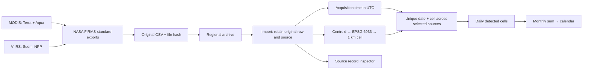

# FireAtlas — visual Data & Method page

## Outcome and scope

Build `/method.html` as the single place to understand and inspect the existing historical calendar. Visitors follow actual NASA FIRMS exports through the transformations implemented in FireAtlas. The landing page remains the place to select an area and explore the calendar.

This work demonstrates data lineage, calculation consistency and known limitations. It does not claim independent scientific approval, clear satellite coverage, sensor calibration, or a predicted competition mark.

## Data contract: use what already exists

| Input | Existing artifact | Role | Boundary |
| --- | --- | --- | --- |
| Original NASA FIRMS exports | `NASA_data/`, original file hashes and request IDs | Original detection fields | Local files; no live NASA connection implied |
| Regional archive | `fireatlas/samples/nasa_firms_northern_california_2022_2026.zip` | Reproducible clipped MODIS / S-NPP standard-product rows | Jan–June 2026 partial; NRT kept separate |
| Imported database | `data/fireatlas.sqlite3`, `core.py` / `archive.py` | Source identity, UTC time, centroid grid, original JSON | A cell-day is a sampling unit, not area burned |
| Case reports | `/api/validity?case=park-2024` and `grove-2025` | Dated source pixels, union, overlap, cell records | Fixed case windows; not an independent evaluation sample |
| Month audit | `/api/harmonization` | Whole-month source and product-version comparison | Separate from the shorter case window |
| CAL FIRE records / cohort | `validity_incident_cohort.json` | Contextual incident association | Never creates satellite counts or establishes recall |
| CMR inventory | `validity_cmr_inventory.json` | Candidate file acquisition metadata | Does not establish usable satellite passes |
| Native masks | `data/validity_masks.sqlite3` | Display actual available/pending state | Missing inputs remain unknown; centroid samples are not complete footprints |

## Actual calculation

For a UTC day, joint cells = MODIS cells + VIIRS cells − cells detected by both. A source pixel count and a cell-day count have different units. No correction for differing detection sensitivity is implied. Original rows stay inspectable after grouping. Historical medians require the existing qualifying source exports and retain product-version caveats.

## Visitor workflow and implementation

1. **Choose Park or Grove.** Both use the same components. The page explicitly names the historical case and UTC day.
2. **Follow five connected illustrations.** Satellites → FIRMS CSV → source/UTC fields → common grid → calendar. Sensor and grid illustrations are labeled schematics. Counts and mini-calendar values come from the case API.
3. **Inspect one actual cell.** Select a cell; click retained observations to inspect timestamps, native confidence, source ID, product version and source hash. Show the same cell and UTC date contributing exactly one count. Display no more than five sample rows with the shown/total label; full source rows remain below and in the ZIP.
4. **Read the daily union equation.** Populate every operand from the same report/date as the case graph. Source-day overlap is not a matched-overpass or fire-count estimate.
5. **Explore the migrated evidence scenes.** Keep sensor scale, observation gaps, common grid, historical timeline and source evidence. Keep Park incident photos inside the existing evidence toggle. Keep Grove's absence of official imagery explicit.
6. **Run the recount.** `/api/validity/check` generates the current case ZIP and runs the existing stdlib analytical checker against it. Display the recorded case total and recomputed total. The response includes timestamp, source manifest checksum (stable across ZIP creation times) and the checker’s explicit `independent_scientific_review: false`.
7. **Inspect calendar-selection evidence.** Incoming `context=calendar` links preserve AOI, sensor series, year/month, selected UTC day and synthetic/imported mode. This selection is labeled separately from the Park/Grove example. Source records, whole-month audit and source ledger use that exact context.
8. **Return to the calendar.** Link to the selected year/month/AOI/series/day. Preserve calendar export and sharing on the landing page.

## Migration map

| Landing content | Destination |
| --- | --- |
| Five-scene validity story, timeline, photographs, sensitivity, CMR and incident cohort | `/method.html#challenge-fit` |
| MODIS / VIIRS sensor explanation | Pipeline and migrated sensor-scale scene |
| Harmonization method audit / JSON | `/method.html#harmonization-audit` |
| Counting method and comparison limits | Collapsed counting rules on method page |
| Source observations and provenance panel | `/method.html#source-records` |
| Source ledger drawer | Collapsed source ledger on method page |
| Calendar source counts, small interpretation warnings, exports | Retained beside calendar because needed to read/use the result |

## Visual design contract

- Deep navy, warm orange for MODIS, pale gold for VIIRS, teal for the common grid.
- A continuous workflow dominates the page; no validity percentage gauge.
- One headline per scene; short labels and one-sentence descriptions. Raw rows, detailed methods and caveats are expandable.
- Desktop uses a horizontal five-stage flow. Phone uses a vertical connected flow with readable labels, not a shrunken desktop SVG.
- Every schematic is labeled. No fabricated orbital positions, geographic footprints, fire perimeters or sensor measurements.
- Photos are dated incident context and remain separate from the record processing.
- Source/API errors clear stale values and cannot produce a successful recount indicator.
- Locally hosted fonts and SVG keep the diagrams usable with external sites blocked. Imported data still needs the local server; failed API requests are visible.
- Keyboard controls, focus styles, semantic headings, SVG descriptions, color-independent unknown hatching and reduced-motion support.

## Verification and acceptance gates

| Check | Acceptance |
| --- | --- |
| Route migration | Dedicated page serves; landing no longer contains the large validation story, audit or records panels |
| Context preservation | Calendar-selected AOI/date/series/data mode reaches source inspector and returns unchanged |
| Workflow figures | Every daily operand equals the report for the selected case/day; union equation balances |
| Recount | Both authentic bundles reproduce existing counts with the separate analytical transform; API rejects synthetic or unknown cases |
| Date/case changes | Clear record selection appropriately; no previous-case check is shown for a new case |
| Empty/error states | Empty day shows unknown observation coverage; failed API never leaves old counts or a successful state |
| Responsive | Inspect screenshots at 1440, 768 and 390 px; no horizontal page overflow; controls and labels remain legible |
| Integration | Calendar renders and selects dates; source rows, JSON and case ZIP remain accessible |
| Packaging | New HTML/CSS/JS in explicit server routes and package assets; service worker cache version bumped |

## Bounded remaining scientific work

The new page can demonstrate existing computational verification. A reviewer outside the implementation can independently inspect original FIRMS rows and reproduce the case calculation using the downloaded bundle. Their identity, date, scope and discrepancies need an actual review record; software must never create that sign-off.

Only an expanded claim about observation opportunities requires native masks, valid geolocation, verified footprints and quality interpretation. Native centroid samples alone cannot establish complete 1 km cell coverage or no-pass conditions. This page documents that boundary; building a full coverage model is outside this migration.

## Implementation verification — 29 September 2026

- `uv run python -m unittest discover -s tests -v`: **81 tests passed**. The added route test checks both real case recounts, the manifest checksum against a downloaded export, rejection of synthetic/unknown cases, static assets and removal of migrated landing sections.
- Headless Chrome, with external requests blocked, at **1440 / 768 / 390 px**: screenshots inspected; no horizontal page overflow or uncaught JavaScript errors. Expanded evidence also fits the phone layout.
- Actual recount results: Park **3,137 pixels / 1,606 cell-days**; Grove **7 pixels / 4 cell-days**. Both report calculation agreement and explicitly retain `independent_scientific_review: false`.
- Exercised all five scenes, case switching, UTC selection, URL synchronization and calendar → source-inspector navigation with area/date/series preserved.
- Confirmed six Park images remain hidden until the evidence toggle opens and hide again when it closes.
- Injected source and recount failures: stale figures clear, unavailable checks disable and failure cannot display a passing result.
- Reduced-motion browser setting, local diagram/font loading with remote services unavailable, and capture-frame visibility checked. No uncoached user comprehension study or external scientific review was performed.
